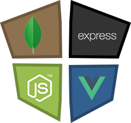
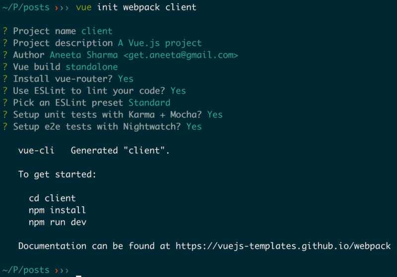
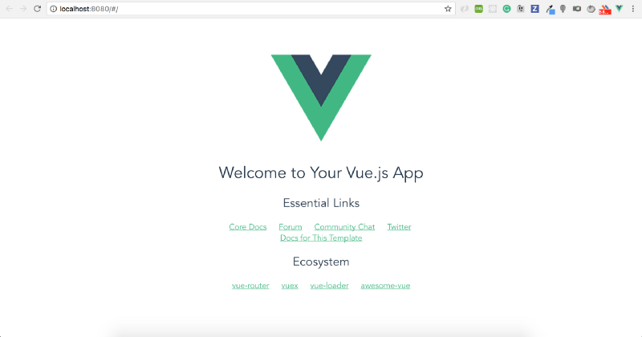
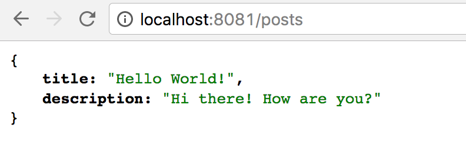

# Создание MEVN-приложения (Часть 1/2)



*Перевод статьи [Aneeta Sharma](https://twitter.com/anaida07): [Build full stack web apps with MEVN Stack [Part 1/2]](https://medium.com/@anaida07/mevn-stack-application-part-1-3a27b61dcae0). Опубликовано с разрешения автора.*

***

Мы в нашей CloudFactory всегда стремимся идти в ногу со временем. И даже не смотря на тот факт, что наша фирма является в первую очередь Ruby-компанией, мы любим инвестироваться в изучение новых технологий.

У нас стояла задача выбрать frontend-фреймворк для будущего full-stack проекта. Выбор стоял между [MEAN](http://mean.io/) и [MERN](http://mern.io/). Но так как фреймворк [Vue.js](https://vuejs.org/) это что-то новое и интересное, то мы захотели попробовать и дали зеленый свет **MEVN**.

Акроним **MEVN** означает - [MongoDB](https://www.mongodb.com/) + [Express.js](http://expressjs.com/) + [VueJS](https://vuejs.org/) + [Node.js](https://nodejs.org/en/). Цель этой статьи - показать, как можно создать базовое MEVN-приложение на стеке технологий MongoDB/Express/VueJS/Node.js.

## Необходимые требования

* базовые знания JavaScript
* Концепция REST и CRUD
* Установленные Node.js и NVM
* Установленная MongoDB

## Что ожидается получить

* full-stack приложение на основе архитектуры MEVN
* CRUD-операции при помощи Express.js
* Подключение к MongoDB (мы будем использовать [Mongoose](http://mongoosejs.com/))

## В данном руководстве используются следующие версии пакетов

* MongoDB v3.0.5
* Express.js v4.15.4
* Vue.js v2.4.2
* Node.js v8.5.0

В статье будет описан процесс создания каркаса приложение на стеке MEVN. Работа с базой данных MongoDB будет описана во второй части данного руководства. Исходный код создаваемого приложения расположен в репозитории на Gitlab - [ MEVN-Application](https://gitlab.com/learning-stacks/learning-express.js/tree/master/mevn-application).

**Примечание переводчика**: *я взял на себя смелость пошагово воссоздать описываемое в данной статье приложение. В результате у меня получился работоспособный аналог приложения. Но в процессе создания проекта мною были внесены незначительные изменения.*

Итак, приступим!

## Развертывание проекта

Для начала создадим директорию с будущим приложением:

```bash
$ mkdir mevn-application
$ cd mevn-application
```

В директорию с проектом необходимо создать поддиректорию для frontend-части приложения. Для этого воспользуемся консольной утилитой `vue-cli` фреймворка Vue.js. Сгенерируем директорию `client` при помощи команды:

```bash
$ vue init webpack client
```

При запуске данная команда задаст серию вопросов о будущем приложении - имя проекта, имя автора проекта, описание проекта, использование `eslint`, использование тестов и так далее. При желании можно выбрать значения по умолчанию путем нажатия клавиши Enter.

Примерный вид выполнения команды `vue-cli` представлен на изображении ниже:



**Примечание переводчика**: *в моем приложении mevn-application не установлена поддержка unit и e2e тестирования, так как это значительно утяжеляет размер проекта; к тому же возможности тестирования не будут использоваться в данном руководстве.*

Теперь необходимо перейти в готовую директорию `client` и запустить внутри нее команду `npm install` для установки всех зависимостей проекта, перечисленных в файле `client/package.json`

**Примечание переводчика**: *в проекте mevn-application мною использовался менеджер пакетов `yarn`; это является личным предпочтением и не более того.*

```bash
$ cd client
$ yarn install
$ yarn run dev
```

Последняя команда `yarn run dev` запускает локальный сервер по адресу `http://localhost:8080/#/` и автоматически запускает браузер по умолчанию по этому же адресу. В результате в окне браузера будет отображена стартовая страница проекта на Vue.js:



Базовая заготовка frontend-части будущего приложения готова. Теперь нужно вернуться немного назад и создать backend-часть приложения на основе Express.js.

```bash
$ cd ..
$ mkdir server
$ cd server
```

Выполним инициализацию серверной части проекта путем запуска команды `yarn init`. Будет также задана серия вопросов о проекте и в результате сформируется файл `package.json`.

Также давайте создадим директорию `src`, внутри которой будут находиться все файлы будущего сервера. В частности, создадим в папке `src` файл `index.js`, который будет главным файлом сервера:

```bash
$ mkdir src
$ touch src/index.js
```

Добавим в проект поддержку автоматической перезагрузки сервера при каждом изменении файлов проекта. Для этого воспользуемся популярным пакетом `nodemon` и добавим его как зависимость для разработки:

```bash
$ yarn add nodemon --dev
```

В файле `server/package.json` добавим секцию `scripts` и пропишем туда команду для `nodemon`, которая заставит пакет отслеживать изменения всех файлов с расширением `js` внутри директории `src`:

```js
...
  "scripts": {
    "start": "nodemon --ext js --watch src/index.js"
  }
...
```

В результате файл `package.json` будет выглядеть таким образом:

```json
{
  "name": "server",
  "version": "1.0.0",
  "description": "server-part",
  "main": "src/index.js",
  "author": "Moe Green",
  "license": "MIT",
  "private": true,
  "scripts": {
    "start": "nodemon --ext js --watch src/index.js"
  },
  "devDependencies": {
    "nodemon": "^1.14.10"
  }
}
```

Теперь проверим работу серверной части приложения - для этого добавим в файле `index.js` строку `console.log('Hello World')` и запустим файл `server/src/index.js` командой:

```bash
$ yarn start
```

**Примечание переводчика**: *автор статьи использует команду `npm start`, что ничего не меняет.*

Если все было сделано правильно, то пакет `nodemon` успешно запустится и в консоли будет выведено сообщение из файла:


## Настройка серверной части

Теперь настало время приступить к настройке сервера. Для этого установим пакет `express.js` как зависимость проекта:

```bash
$ yarn add express
```

Затем установим дополнительные пакеты для разработки сервера. Пакет `morgan` для ведения логов, пакет `body-parser` для парсинга приходящих со стороны клиента данных, пакет `cors` для задействования [CORS](https://medium.com/trisfera/using-cors-in-express-cac7e29b005b):

```bash
$ yarn add morgan body-parser cors
```

В результате файл `package.json` примет такой вид:

```json
{
  "name": "server",
  "version": "1.0.0",
  "description": "server-part",
  "main": "src/index.js",
  "author": "Moe Green",
  "license": "MIT",
  "private": true,
  "scripts": {
    "start": "nodemon --ext js --watch src/index.js"
  },
  "dependencies": {
    "body-parser": "^1.18.2",
    "cors": "^2.8.4",
    "express": "^4.16.2",
    "morgan": "^1.9.0"
  },
  "devDependencies": {
    "nodemon": "^1.14.10"
  }
}
```

В файле `src/index.js` выполним подключение установленных пакетов, а также запустим их на выполнение как middleware:

```js
const express = require('express')
const bodyParser = require('body-parser')
const cors = require('cors')
const morgan = require('morgan')

const app = express()
app.use(morgan('combined'))
app.use(bodyParser.json())
app.use(cors())
```

В конце файла `src/index.js` запустим сервер `express` на локальном порту `8081`. Для этого предварительно создадим в директории `src` поддиректорию `config` с файлом конфигурации `config.js` внутри. Этот файл будет содержать все необходимые переменные и константы для сервера; в частности - номер локального порта:

```bash
$ mkdir config
$ touch config/config.js
```
Содержание файла `config/config.js`:

```javascript
module.exports = {
  port: 8081
}
```

Подключим конфигурационный файл `config/config.js` в главный файл сервера `src/index.js`:

```js
...
const config = require('./config/config')
...
```

... и наконец включим сервер `express`:

```js
...
app.listen(process.env.PORT || config.port,
  () => console.log(`Server start on port ${config.port} ...`))
...
```

В итоге на данном этапе разработки сервер `express` будет выглядеть таким образом:

```js
const express = require('express')
const bodyParser = require('body-parser')
const cors = require('cors')
const morgan = require('morgan')
const config = require('./config/config')

const app = express()
app.use(morgan('combined'))
app.use(bodyParser.json())
app.use(cors())

app.listen(process.env.PORT || config.port,
  () => console.log(`Server start on port ${config.port} ...`)
```

Серверная часть приложения запущена на порту 8081 (`localhost:8081`). Фронтенд-часть приложения запущена на порту 8080 (`localhost:8080`).

## Создание первого endpoint

Теперь начинается самое интересное - давайте создадим для сервера первый маршрут (endpoint) и пусть это будет путь до страницы со всеми записями (posts). Для начала мы просто протестируем, правильно ли сервер отвечает на наши запросы:

```js
app.get('/posts', (req, res) => {
  res.send(
    [{
      title: "Hello World!",
      description: "Hi there! How are you?"
    }]
  )
})
```

Если теперь мы "постучимся" на сервер по адресу `http://localhost:8081/posts` из [Postman](https://www.getpostman.com/) или из браузера, то в ответ должны получить ответ:



Отлично - сервер `express` работает и правильно отвечает на наши запросы!

## Настройка связи между frontend и backend частями

Настало время "связать" обе части нашего приложения. Сделать так, чтобы frontend-часть (client) смогла посылать запросы на backend-часть (server) и получать от сервера ответы.

Для этого воспользуемся очень популярным пакетом `axios`. Перейдем в клиентскую часть приложения (client) и выполним там установку этого пакета как зависимость проекта:

```bash
$ cd client
$ yarn add axios
```

В директории `client/src` создадим поддиректорию `services` с файлом `api.js` внутри. В этом файле мы подключим библиотеку `axios`, а затем экспортируем ее из этого файла как функцию с предустановленной настройкой - базовым адресом запроса по умолчанию. Теперь каждый раз, как `axios` будет "стучаться" на сервер, он будет "идти" по этому адресу:

```js
import axios from 'axios'

export default () => {
  return axios.create({
    baseURL: 'http://localhost:8081'
  })
}
```

В директории `services` создадим еще один файл `PostsService.js`, в котором подключим файл `api.js` как модуль. В итоге внутри модуля `PostsService.js` мы можем пользоваться готовым заранее настроенным `axios`. Экспортируем модуль `PostsService.js` как объект, у которого будет целый ряд методов - каждый метод для определенного случая.

Одним из таких случаев на данный момент у нас является факт получения данных с сервера. Для этого создадим метод `fetchPosts`:

```js
import api from '@/services/api'

export default {
  fetchPosts () {
    return api().get('posts')
  }
}
```

На первый взгляд функция `fetchPosts` может показаться непонятной и обескураживающей. Но на самом деле здесь все просто. `api()` - это вызов на исполнение возвращаемой модулем `api` функции. Эта запись равносильна записи `axios.get('posts')`. Передача аргумента `posts` также может вызвать вопрос, но дело в том, что axios умеет "склеивать" адреса, поэтому в итоге получим такой адрес - `http://localhost:8081/posts`.

В файле маршрутов `src/routes/index.js` добавим маршрут для страницы (компонента) `PostsPage`, на которой будут отображаться все записи (posts), полученные с сервера:

```js
import Start from '@/components/pages/StartPage'
import Posts from '@/components/pages/PostsPage'

const routes = [
  {
    path: '/',
    name: 'Start',
    component: Start
  },
  {
    path: '/posts',
    name: 'Posts',
    component: Posts
  }
]

export default routes
```

... и подключим созданный маршрут в индексный файл `src/router/index.js` маршрутизатора:

```js
import Vue from 'vue'
import Router from 'vue-router'
import routes from '@/routes'

Vue.use(Router)

export default new Router({
  mode: 'history',
  routes
})
```

Нам осталось создать сам компонент `PostsPage` по пути `components/pages/PostsPage.vue`. Но предварительно мы установим еще один пакет - `bootstrap` для быстрой и правильной стилизации vue-компонентов.

```bash
$ yarn add bootstrap
```

Подключать данный плагин будем через систему плагинов. Создадим поддиректорию `src/plugins` и в ней файл `bootstrap.js`, отвечающий за настройку самого Bootstrap. В нашем случае ничего настраивать не будем, а просто импортируем установленный `bootstrap`:

```js
import 'bootstrap/dist/css/bootstrap.css'
```

... и затем подключим его в `src/main.js`:

```js
import Vue from 'vue'
import App from './App'
import router from './router'
import '@/plugins/bootstrap'

Vue.config.productionTip = false

/* eslint-disable no-new */
new Vue({
  el: '#app',
  router,
  template: '<App/>',
  components: { App }
})
```

**Примечание переводчика**: *данная система подключения плагинов была "подсмотрена" мною здесь - [vue-2-boilerplate](https://github.com/petervmeijgaard/vue-2-boilerplate)*

Осталось создать сам компонент `PostsPage.vue` (*переводчик данной статьи большой поклонник шаблонизатора [Pug](https://pugjs.org/api/getting-started.html), поэтому при создании Vue-компонентов везде и всюду будет такая "экзотическая" разметка*):

```html
<template lang="pug">
  .container
    .row
      .col-xs-12
        h1
          | Posts
        h3
          | This file will list all the posts

        section.panel.panel-success( v-if="posts.length" )
          .panel-heading
            | list of posts
          table.table.table-striped
            tr
              th Title
              th Description
              th Action
            tr( v-for="(post, index) in posts", :key="post.title" )
              td {{ post.title }}
              td {{ post.description }}

        section.panel.panel-danger( !v-if="posts.length" )
          p
            | There are no posts ... Lets add one now!
          div
            router-link( :to="{ name: 'NewPost' }" )
              | add new post
</template>

<script>
  import PostsService from '@/services/PostsService'
  export default {
    name: 'PostsPage',
    data () {
      return {
        posts: []
      }
    },
    methods: {
      async getPosts () {
        const response = await PostsService.fetchPosts()
        this.posts = response.data.posts
      }
    },
    mounted () {
      this.getPosts()
    }
  }
</script>
```

Что здесь происходит? Во-первых, в шаблоне `template` компонента определяем две секции - секция `section.panel.panel-success` для отображения записей (posts,) если они есть ("пришли" с сервера); и секция `section.panel.panel-danger`, если записей нет.

В скриптах `script` компонента мы подключаем модуль `PostsService` чтобы воспользоваться методом `fetchPosts`:

```js
import PostsService from '@/services/PostsService'
```

Затем в компоненте создаем метод `getPosts`, который через async-await вызовет на исполнение метод `fetchPosts` объекта `PostsService`. Результат будет записан в массив `this.posts`. И наконец мы "повесим" метод `getPosts` на хук `mounted`, чтобы он вызывался на исполнение каждый раз, как компонент `PostsPage.vue` будет смонтирован в DOM.

Ну и в секции `section.panel.panel-success` данные из массива `this.posts` будут "разбрасываться" по таблице через директиву `v-for`.

Напоследок стоит обратить внимание на использование директивы `v-if`. В моем случае "классическим" вариантом было бы писать так - `v-if` + `v-else`. Однако в коде прописано `v-if="posts.length"` + `!v-if="posts.length"`. Сделано это для большей практичности данного примера, ибо - *[A v-else element must immediately follow a v-if or a v-else-if element - otherwise it will not be recognized.](https://vuejs.org/v2/guide/conditional.html#v-else).*

Теперь если запустить клиентскую часть `yarn run dev` и перейти в браузере по адресу `http://localhost:8080/posts`, то мы должны получить такой результат:


Все хорошо — на странице записей нет, ибо мы их не получили с сервера, так и должно быть. Сервер не "отдал" записи (posts), так как он не подключен к базе данных MongoDB и не может "достать" их оттуда.

Подключением к базе данных MongoDB и операциями CRUD мы займемся в следующей части данного руководства.

## Полезные ссылки по теме

[Building a Simple CRUD Application with Express and MongoDB](https://zellwk.com/blog/crud-express-mongodb/)
[Getting Started with Node.js, Express, MongoDB](https://closebrace.com/tutorials/2017-03-02/the-dead-simple-step-by-step-guide-for-front-end-developers-to-getting-up-and-running-with-nodejs-express-and-mongodb)
[Full Stack Apps with Vue.js and Express.JS](https://www.youtube.com/watch?v=Fa4cRMaTDUI)
