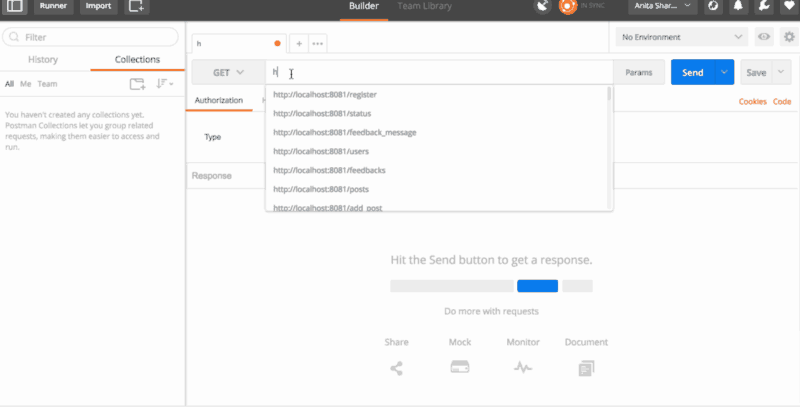
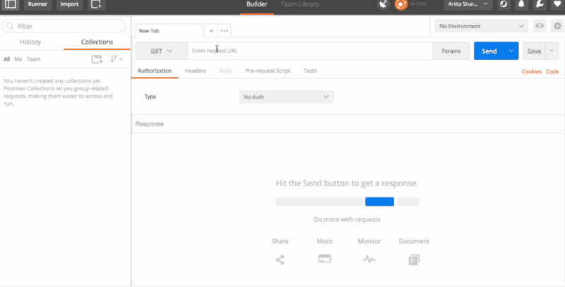
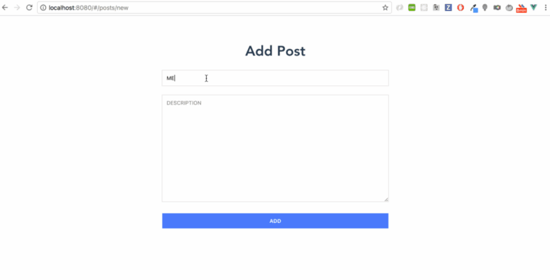
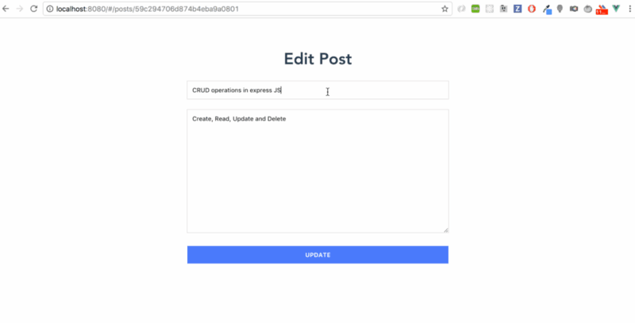
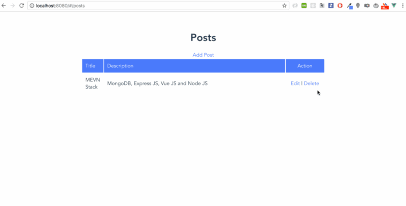

# Создание MEVN-приложения (Часть 2/2)


*Перевод статьи [Aneeta Sharma](https://twitter.com/anaida07): [Build full stack web apps with MEVN Stack [Part 2/2]](https://medium.com/devnetwork/mevn-stack-application-part-2-2-9ebcf8a22753). Опубликовано с разрешения автора.*

***

Эта статья является продолжением [предыдущей части руководства](https://medium.com/@gearmobile/%D1%81%D0%BE%D0%B7%D0%B4%D0%B0%D0%BD%D0%B8%D0%B5-mevn-%D0%BF%D1%80%D0%B8%D0%BB%D0%BE%D0%B6%D0%B5%D0%BD%D0%B8%D1%8F-%D1%87%D0%B0%D1%81%D1%82%D1%8C-1-2-9ad714260037), посвященного цели создания базового функционала приложения, разрабатываемого на стеке технологий MongoDB, Express.js, Vue.js and Node.js.

В этой части будет уделено внимание вопросу операций CRUD (Create, Read, Update, Delete), выполняемых при помощи Express.js и MongoDB (для работы с MongoDB мы будем использовать [Mongoose](http://mongoosejs.com/)).

С исходным кодом готового проекта можно ознакомиться в репозитории на Gitlab - [MEVN Application](https://gitlab.com/learning-stacks/learning-express.js/tree/master/mevn-application).

## Что было сделано в предыдущей части

* был создан базовый каркас приложения
* было создано соединение между frontend(Vue.js) и backend(Express.js) частями приложения

## Что будет сделано в этой части

* реализация CRUD-операций при помощи Mongoose

В предыдущей части мы остановились на следующем месте создания приложения. В клиентской части при переходе по адресу `http://localhost:8080/posts` мы ожидаем отображения в окне браузера списка всех записей (posts), которые получаем с сервера при помощи функции `fetchPosts` модуля `PostService.js`.

Давайте снова запустим клиентскую часть командой `yarn run dev` и серверную часть командой `yarn start`.

Процесс установки и запуска MongoDB опустим, так как это выходит за рамки этой и так довольно объемной статьи; подразумевается, что читатели данного руководства уже обладают достаточным уровнем знаний в этой области.

Теперь если в браузере мы перейдем по адресу `http://localhost:8080/posts`, то увидим такую страницу (что и ожидалось):


Создадим подключение к MongoDB при помощи Mongoose. Для этого сначала установим пакет `mongoose` как зависимость проекта:

```js
$ yarn add mongoose
```

И подключим установленный `mongoose` в главном файле сервера:

```js
const mongoose = require('mongoose')
```

Помимо этого сделаем замену промиса библиотеки Mongoose нативным промисом Node.js:

```js
mongoose.Promise = global.Promise
```

Осталось только подключить Mongoose к MongoDB и связать это действие с запуском сервера `express` для большей логичности:

```javascript
mongoose.connect(config.dbURL, config.dbOptions)
mongoose.connection
  .once('open', () => {
    console.log(`Mongoose - successful connection ...`)
    app.listen(process.env.PORT || config.port, () => console.log(`Server start on port ${config.port} ...`))
  })
  .on('error', error => console.warn(error))
```

Что происходит в этой части кода? В строке `mongoose.connect` мы подключаем Mongoose к MongoDB. Адрес подключения и опции подключения указаны в файле `config/config.js`:

```javascript
module.exports = {
  port: 8081,
  dbURL: 'mongodb://localhost/articles',
  dbOptions: { useMongoClient: true }
}
```

Затем в строке `mongoose.connection` мы становимся на прослушку события подключения Mongoose к MongoDB. Если соединение произошло успешно (событие `open`), то при помощи метода `once` сообщаем в консоли о данном факте; следующим действием запускаем сервер `express` - `app.listen`.

Если же при соединении произошла ошибка `error`, то при помощи метода `on` сообщаем об этом в консоли.

**Примечание переводчика**: *для полноты картины можно было бы еще обработать событие `disconnected`, если вдруг Mongoose "отвалится" от MongoDB.*

Можно задать вопрос - зачем такие сложности в данном примере кода? На самом деле здесь все правильно и логично, так как мы запускаем сервер `express` только тогда, когда произошло успешное подключение к базе данных MongoDB.

## Mongoose - создание Schema

Прежде чем продолжать работать с MongoDB, мы должны отступить слегка в сторону Mongoose.

Основная цель создания и использования Mongoose - это типизация и верификация данных, записываемых в MongoDB. Другими словами, в Mongoose есть стандартизированный тип данных, создаваемый конкретно для одной из баз данных в MongoDB.

Такой тип данных в Mongoose называется Schema. Для нашей базы данных articles мы создадим Schema под названием PostSchema. Для этого создадим поддиректорию `src/models` и в ней файл `post-model.js` с таким содержанием:

```javascript
const mongoose = require('mongoose')
const Schema = mongoose.Schema

const PostSchema = new Schema({
  title: {
    type: String,
    unique: true
  },
  description: {
    type: String
  }
})

const PostModel = mongoose.model('posts', PostSchema)

module.exports = PostModel
```

Что происходит в данном файле? В нем мы подключаем библиотеку Mongoose для того, чтобы воспользоваться ее методом Schema. При помощи метода Schema создаем свой пользовательский тип данных PostSchema, в котором говорим, что все данные, которые будут записываться в базу данных articles, должны быть объектами и иметь текстовое поле `title` и текстовое поле `description`.

Затем при помощи PostSchema мы создаем пользовательскую модель PostModel при помощи метода `model` библиотеки Mongoose. Библиотека Mongoose "прикручивает" к модели PostModel коллекцию методов, например метод `save()`, `remove()`, `find()` и многие другие.

Эту модель мы экспортируем и при помощи этой модели (*и ее методов*) будем создавать и сохранять данные в articles.

## Express - создание маршрутов

Прежде чем продолжать работу с моделями Mongoose, внесем в главный файл `src/index.js` изменение - добавим поддержку router. Это делается для того, чтобы поддержать чистоту и читаемость кода.

Создадим поддиректорию `src/routes` и в нем файл `posts.js`, в котором будут содержаться все маршруты, связанные с endpoint  - `/posts`. В этом файле также подключим модель PostModel:

```javascript
const Post = require('../models/post-model')
```

В итоге заголовок файла `src/routes.posts.js` будет выглядеть таким образом:

```javascript
const express = require('express')
const router = express.Router()
const Post = require('../models/post-model')
```

В главном файле `src/index.js` подключим файл с маршрутами:

```javascript
app.use(require('./routes/posts'))
```

Полный вариант индексного файла будет выглядеть таким образом:

```javascript
const express = require('express')
const bodyParser = require('body-parser')
const cors = require('cors')
const morgan = require('morgan')
const mongoose = require('mongoose')
const config = require('./config/config')
mongoose.Promise = global.Promise

const app = express()
app.use(morgan('combined'))
app.use(bodyParser.json())
app.use(cors())

app.use(require('./routes/posts'))

mongoose.connect(config.dbURL, config.dbOptions)
mongoose.connection
  .once('open', () => {
    console.log(`Mongoose - successful connection ...`)
    app.listen(process.env.PORT || config.port, () => console.log(`Server start on port ${config.port} ...`))
  })
  .on('error', error => console.warn(error))
```

## Операция CREATE

В файле `src/routes/posts.js` создадим обработку операции CREATE - создания и записи в базу данных articles:

```javascript
// => create post
router.post('/posts', (req, res) => {
  const post = new Post({
    title: req.body.title,
    description: req.body.description
  })
  post.save((err, data) => {
    if (err) {
      console.log(err)
    } else {
      res.send({
        success: true,
        message: `Post with ID_${data._id} saved successfully!`
      })
    }
  })
})
```

Что происходит в этом участке кода? Здесь идет обработка POST-запроса на endpoint `/posts`. Функция обратного вызова создает новый объект `post` при помощи модели Post. В качестве значения полей `title` и `description` будут использоваться приходящие со стороны клиента значения поля `body` объекта `request`.

Экземпляр `post` модели Post наследует у него методы для записи и редактирования в базу данных. В данном случае мы воспользуемся методом `save` для записи объекта `post` в базу данных MongoDB. Если при записи в MongoDB произошла ошибка, то выведем ее в консоль. Иначе скажем `express`, чтобы он "отрапортовал" нам об успешном выполнении операции при помощи метода `send`.

Конечно же нужно протестировать обработку данного POST-запроса. Для этого я воспользуюсь очень удобным инструментом [Postman](https://www.getpostman.com/):



Как видим, сервер `express` успешно принимает POST-запрос и при помощи Mongoose делает запись в базу данных MongoDB.

## Операция READ

Операция чтения всех данных из базы данных articles выполняется следующим участком кода:

```javascript
// => read all posts
router.get('/posts', (req, res) => {
  Post.find({}, 'title description', (err, posts) => {
    if (err) {
      res.sendStatus(500)
    } else {
      res.send({ posts: posts })
    }
  }).sort({ _id: -1 })
})
```

Здесь при GET-запросе на endpoint `/posts` мы воспользуемся моделью Post и ее методом `find`, который найдет все записи в базе данных articles и вернет их методом `send`.

Но перед этим будет выполнена сортировка найденных данных методом `sort`. Если вдруг произошла ошибка чтения базы данных, `express` сообщит об этом, отправив код ошибки 500 ("Ошибка сервера") методом `sendStatus`.

Давайте получим с помощью [Postman](https://www.getpostman.com/) все имеющиеся в базе данных articles записи:



Немного же их пока!

## Создание и отправка записей из клиента

Настало время настроить возможность создания и отправки данных из клиента (client). Для этого первоначально создадим новый компонент (страницу) `src/components/pages/NewPostPage.vue` и пропишем для него маршрут в `src/routes/index.js`:

```javascript
import Start from '@/components/pages/StartPage'
import Posts from '@/components/pages/PostsPage'
import NewPost from '@/components/pages/NewPostPage'

const routes = [
  {
    path: '/',
    name: 'Start',
    component: Start
  },
  {
    path: '/posts',
    name: 'Posts',
    component: Posts
  },
  {
    path: '/posts/new',
    name: 'NewPost',
    component: NewPost
  }
]

export default routes
```

Затем наполним содержимым сам компонент `NewPostPage.vue`:

```javascript
<template lang="pug">
  .container
    .row
      .col-xs-12
        h1
          | Add New Post
        form
          .form-group
            input.form-control( type="text", name="title", id="title", placeholder="Title", v-model.trim="post.title" )
          .form-group
            textarea.form-control( type="text", rows="5", name="description", id="description", placeholder="Description", v-model.trim="post.description" )
          .form-group
            button.btn.btn-block.btn-primary( type="button", name="addPost", id="addPost", @click="addPost()" )
              | add new post
          section
            button.btn.btn-success.btn-block( type="button", @click="goBack()" )
              | go to posts page
</template>

<script>
  import PostsService from '@/services/PostsService'
  export default {
    name: 'NewPostPage',
    data () {
      return {
        post: {
          title: '',
          description: ''
        }
      }
    },
    methods: {
      async addPost () {
        if (this.post.title !== '' && this.post.description !== '') {
          await PostsService.addNewPost({
            title: this.post.title,
            description: this.post.description
          })
          this.$router.push({ name: 'Posts' })
        } else {
          alert('Empty fields!')
        }
      },
      goBack () {
        this.$router.push({ name: 'Posts' })
      }
    }
  }
</script>
```

Что мы видим в этом компоненте? Секция `template` маленькая и простая - это всего лишь форма для создания и отправки данных. Данные отправляются по нажатию на кнопку `button`.

**Примечание переводчика**: *здесь было бы правильнее воспользоваться обработкой события `submit` формы; для этого переместить метод `addPost` на `form( @submit.prevent="addPost" )` и поменять тип кнопки на `"submit"` ).*

Отправка данных из компонента выполняется методом `addPost`, который через async-await делает следующее. Если значения полей формы не пустые, то вызывает на исполнение метод `addNewPost` модуля `PostsService` (мы создадим этот метод немного позже).

Аргументом метода `addNewPost` передаем объект, который конструируем на основе значения полей формы. Как только метод `addNewPost` успешно выполнился, мы при помощи `router` возвращаемся на страницу со списком всех записей. Если вдруг произошла ошибка, то "кричим" об этом.

Метод `goBack` также возвращает нас назад на страницу со списком всех записей, но только при нажатии на кнопку `button`.

Нам осталось определить метод `addNewPost`, который и будет отправлять данные на сервер `express`. Для этого в файле `src/services/PostsService.js` добавим такое содержание:

```javascript
import api from '@/services/api'

export default {
  fetchPosts () {
    return api().get('posts')
  },
  addNewPost (params) {
    return api().post('posts', params)
  }
}
```

Как видим, метод `addNewPost` обрабатывает POST-запрос при помощи `axios`, которому в качестве аргументов передает путь и данные `params`, которые тот отправит `express`'у.

Все готово для создания и отправки данных. Откроем браузер по адресу `http://localhost:8080/posts/new` - должна отобразиться форма, в которой введем данные и отправим на сервер. Затем проверим, что сервер получил наши данные и записал их в базу данных. Вернемся на страницу со список всех записей - `http://localhost:8080/posts`:



Операции CREATE и READ успешно нами созданы и протестированы. Осталось создать две оставшиеся - UPDATE и DELETE.

## Операция UPDATE

На стороне сервера в файле `src/routes/posts.js` добавим два метода - для получения единичной записи по ID и для обновления единичной записи по ID:

```javascript
// => read single post
router.get('/posts/:id', (req, res) => {
  Post.findById(req.params.id, 'title description', (err, post) => {
    if (err) {
      res.sendStatus(500)
    } else {
      res.send(post)
    }
  })
})
```

```javascript
// => update single post
router.put('/posts/:id', (req, res) => {
  Post.findById(req.params.id, 'title description', (err, post) => {
    if (err) {
      console.log(err)
    } else {
      if (req.body.title) {
        post.title = req.body.title
      }
      if (req.body.description) {
        post.description = req.body.description
      }
      post.save(err => {
        if (err) {
          res.sendStatus(500)
        } else {
          res.sendStatus(200)
        }
      })
    }
  })
})
```

В случае с получением единичной записи все просто. Мы обрабатываем GET-запрос на endpoint `/posts/:id`. Воспользуемся моделью Post и методом `findById` библиотеки Mongoose.

Как видно из самого названия метода, он ищет в базе данных записи с указанным ID. В нашем случае ID приходит со стороны клиента как значение `id` объекта `request`. Далее мы "говорим" Mongoose, чтобы он вернул нам только поля `title` и `description` найденного объекта. Если все плохо, то `express` сообщает нам статус 500; если все хорошо - возвращает найденную запись.

В случае с обновлением записи в базе данных все происходит почти также. По PUT-запросу на endpoint `/posts/:id` ищется запись с указанным ID. Если запись найдена, то выполняем две проверки. Если с клиента пришло значение поля `title`, то записываем его как значение одноименного поля `title` объекта `post`.

Если с клиента пришло значение поля `description`, то записываем его как значение одноименного поля `description` объекта `post`. Тем самым мы обновляем найденный объект полученными с клиента данными.

Осталось только записать обновленный `post` снова в базу данных. Express рапортует об успешности или неуспешности записи в базу данных.

## Обновление записи из клиента

В клиентской части приложения добавляем еще один компонент (страницу) - `EditPostPage.vue`. В это компоненте мы будет получать из базы данных единичную запись по ее ID; редактировать поля `title` и `description` этой записи; и снова отправлять эту запись на сервер для записи в базу данных, тем самым обновляя ее.

Пропишем в маршруты клиента `src/routes/index.js` новый компонент `EditPostPage.vue`:

```javascript
import Start from '@/components/pages/StartPage'
import Posts from '@/components/pages/PostsPage'
import NewPost from '@/components/pages/NewPostPage'
import EditPost from '@/components/pages/EditPostPage'

const routes = [
  {
    path: '/',
    name: 'Start',
    component: Start
  },
  {
    path: '/posts',
    name: 'Posts',
    component: Posts
  },
  {
    path: '/posts/new',
    name: 'NewPost',
    component: NewPost
  },
  {
    path: '/posts/:id',
    name: 'EditPost',
    component: EditPost
  }
]

export default routes
```

И наполним его содержимым:

```javascript
<template lang="pug">
  section.edit
    h1
      | edit post
    form( @submit.prevent="editPost()" )
      div
        input( type="text", name="title", id="title", placeholder="Title", v-model.trim="post.title" )
      div
        input( type="text", name="description", id="description", placeholder="Description", v-model.trim="post.description" )
      div
        button( type="submit", name="editPost" )
          | edit post
    div
      router-link( :to="{ name: 'Posts' }" )
        | go to list of posts
</template>

<script>
  import PostsService from '@/services/PostsService'
  export default {
    name: 'EditPostPage',
    data () {
      return {
        post: {
          title: '',
          description: ''
        }
      }
    },
    methods: {
      async getPost () {
        const response = await PostsService.getPost({ id: this.$route.params.id })
        this.post.title = response.data.title
        this.post.description = response.data.description
      },
      async editPost () {
        if (this.post.title !== '' && this.post.description !== '') {
          await PostsService.updatePost({
            id: this.$route.params.id,
            title: this.post.title,
            description: this.post.description
          })
          this.$router.push({ name: 'Posts' })
        }
      }
    },
    mounted () {
      this.getPost()
    }
  }
</script>
```

В шаблоне `template` компонента у нас все также есть простая форма и метод `editPost` для отправки на сервер данных. Также есть ссылка router-link, которая перенаправит нас на страницу Posts при клике на нее.

В логической части компонента у нас присутствуют два метода модуля `PostsService` - `getPost` и `updatePost`. Метод `getPost` предельно прост - получаем запись с сервера по указанному ID.

Как только получили - записываем их в данные компонента, в объект `post`. Единственный момент - мы "вешаем" метод на хук `mounted`, чтобы он вызывался автоматически на исполнение.

Метод `updatePost` также прост и понятен - там нечего рассказывать. Поэтому в файле `src/services/PostsService.js` мы добавим оба этих метода:

```javascript
import api from '@/services/api'

export default {
  fetchPosts () {
    return api().get('posts')
  },
  addNewPost (params) {
    return api().post('posts', params)
  },
  getPost (params) {
    return api().get(`posts/${params.id}`)
  },
  updatePost (params) {
    return api().put(`posts/${params.id}`, params)
  }
}
```

Теперь в браузере можем протестировать вновь созданную страницу:



## Операция DELETE

Для операции удаления записей в базе данных давайте создадим такой обработчик:

```javascript
// => delete single post
router.delete('/posts/:id', (req, res) => {
  Post.remove({ _id: req.params.id }, err => {
    if (err) {
      res.sendStatus(500)
    } else {
      res.sendStatus(200)
    }
  })
})
```

В клиентской части добавим в компонент `src/components/pages/PostsPage.vue` кнопку для удаления записи:

```javascript
<template lang="pug">
  .container
    .row
      .col-xs-12
        h1
          | Posts
        h3
          | This file will list all the posts
        div
          router-link( :to="{ name: 'NewPost' }" )
            | add new post

        section.panel.panel-success( v-if="posts.length" )
          .panel-heading
            | list of posts
          table.table.table-striped
            tr
              th Title
              th Description
              th Action
            tr( v-for="(post, index) in posts", :key="index" )
              td {{ post.title }}
              td {{ post.description }}
              td
                router-link( :to="{ name: 'EditPost', params: { id: post._id } }" )
                  | edit post
                button.btn.btn-danger.btn-sm( type="button", @click="removePost(post._id)" )
                  | delete

        section.panel.panel-danger( v-else )
          p
            | There are no posts ... Lets add one now!
          div
            router-link( :to="{ name: 'NewPost' }" )
              | add new post
</template>

<script>
  import PostsService from '@/services/PostsService'
  export default {
    name: 'PostsPage',
    data () {
      return {
        posts: []
      }
    },
    methods: {
      async getPosts () {
        const response = await PostsService.fetchPosts()
        this.posts = response.data.posts
      },
      async removePost (value) {
        await PostsService.deletePost(value)
        this.getPosts()
      }
    },
    mounted () {
      this.getPosts()
    }
  }
</script>
```

На кнопку повесим обработчик события `removePost`, которому аргументом будем передавать ID записи. `removePost` будет использовать метод `deletePost` модуля `PostsService` для удаления записи из базы данных.

В файле `src/services/PostsService.js` определим метод `deletePost`:

```javascript
import api from '@/services/api'

export default {
  fetchPosts () {
    return api().get('posts')
  },
  addNewPost (params) {
    return api().post('posts', params)
  },
  getPost (params) {
    return api().get(`posts/${params.id}`)
  },
  updatePost (params) {
    return api().put(`posts/${params.id}`, params)
  },
  deletePost (id) {
    return api().delete(`posts/${id}`)
  }
}
```

Протестируем из браузера удаление записей:



Все отлично - операции удаления записей работает успешно. На данном этапе можно сказать, что задача успешно выполнена и нами создано приложение, выполняющее основные операции с записями в базе данных.

## Замечание

**Примечание переводчика**: *одним из желательных улучшений данного проекта можно смело назвать следующее. В серверной части, в файле `src/routes/posts.js` можно было бы отделить маршруты от логики и логику вынести в отдельный файл контроллеров.*

Например так, как это делается в этом примере - [Adding Controllers | Creating a REST API with Node.js](https://www.youtube.com/watch?v=ucuNgSOFDZ0&index=14&list=PL55RiY5tL51q4D-B63KBnygU6opNPFk_q).

## Полезные ссылки

* [Easily Develop Node.js and MongoDB Apps with Mongoose](https://scotch.io/tutorials/using-mongoosejs-in-node-js-and-mongodb-applications)
* [Node.js, Express and Mongoose Tutorial](http://theholmesoffice.com/node-js-express-and-mongoose/)
