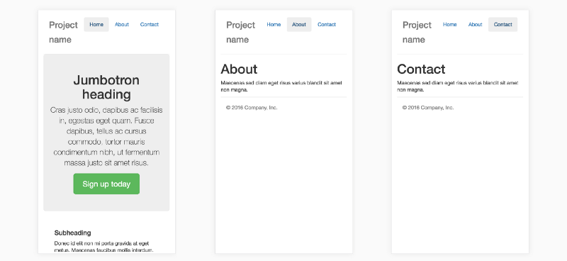
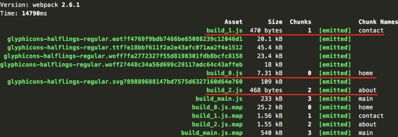
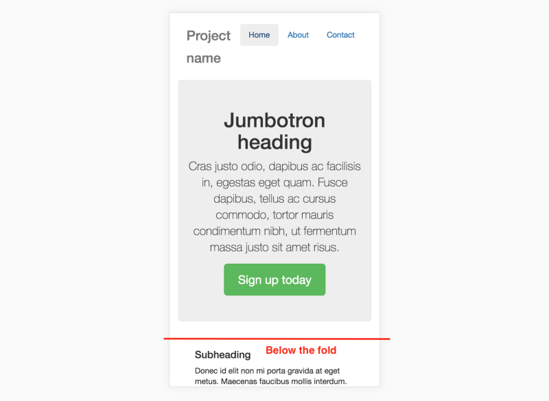
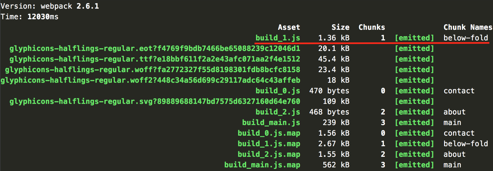

# Паттерны разделения кода приложения на Vue.js

*Перевод статьи  [Anthony Gore](https://twitter.com/@anthonygore): [3 Code Splitting Patterns For VueJS and Webpack][1].*

Разделение кода применительно к одностраничному приложению является хорошим способом увеличить первоначальную загрузку приложения.

Так как в этом случае пользователю нет необходимости ждать, пока загрузится все приложение целиком. Он может начать пользоваться приложением с самого начала, как только началась загрузка этого приложения. 

Такой подход улучшает взаимодействие пользователя с приложением, особенно это касается мобильных приложений. Этот фактор также важен для поисковой оптимизации, так как Google понижает в поисковой выдаче сайты с низкой скоростью загрузки.

На прошлой неделе мною была написана статья о том, как разделять код приложения, написанного на Vue.js при помощи Webpack - [Code Splitting With Vue.js And Webpack][2].

Если объяснить в двух словах - все, что помещается в единый файл сборки приложения, может быть легко разделено Webpack. Это происходит потому, что Webpack создает точки разделения кода в месте подключения модулей. Vue.js в свою очередь может асинхронно загружать компоненты.

Я считаю, что самым тяжелым в задаче разделения кода приложения является не сам процесс, а определение момента, *когда* и *где* это нужно делать.

В этой статье я представлю **три паттерна** разделения кода одностраничного приложения, написанного на Vue.js:

  * постранично
  * вне видимости
  * по условию

## Постранично

Разделение кода *постранично* является самым простым и наглядным способом, чтобы понять сам принцип метода разделения кода.

Давайте возьмём для примера простое мобильное приложение, имеющее три страницы:



Если в данном примере каждая страница представлена отдельным компонентом, её отображающим (`Home.vue`, `About.vue`, `Contact.vue`), то можно воспользоваться динамической функцией `import` для создания отдельной сборки для каждого файла.

Если пользователь будет перемещаться по страницам, то Webpack будет асинхронно загружать файлы, соответствующие запрашиваемой пользователем страницы.

Такой способ очень легко реализовать, если в приложении используется [vue-router][3], так как в этом случае все страницы обязаны быть отдельными компонентами:

```js
const Home = () => import(/* webpackChunkName: "home" */ './Home.vue');
const About = () => import(/* webpackChunkName: "about" */ './About.vue');
const Contact = () => import(/* webpackChunkName: "contact" */ './Contact.vue');
const routes = [
  { path: '/', name: 'home', component: Home },
  { path: '/about', name: 'about', component: About },
  { path: '/contact', name: 'contact', component: Contact }
];
```

Давайте взглянем на статистику, выводимую в консоли в процессе сборки Webpack данного кода. В этом логе каждая страница представлена отдельным файлом (`build_0.js`, `build_1.js`, `build_2.js`).

Однако обратите внимание, что в логе также присутствует главный файл сборки `build_main.js`, в котором находится код, общий для всех остальных файлов; в этом файле расположена логика для асинхронной загрузки всех остальных файлов.

Этот главный файл будет загружен в любом случае, вне зависимости от того, какой маршрут приложения выберет пользователь:



Продолжим инспектирование приложения и перейдем в браузер. Например, я попробую загрузить страницу "Contact" приложения по адресу `http://localhost:8080/#/contact`. Если открыть в браузере вкладку "Network" инструмента разработчика, то можно увидеть список файлов, которые загружались в этом случае:


Обратите внимание на строку с файлом `build_main.js` - напротив этого имени в колонке "Initiator" стоит `index`. Это означает, что файл `index.html` является инициатором вызова данного файла на исполнение. Впрочем, этого и следовало ожидать.

Но как насчёт другого инициатора - `build_1.js is bootstrap_a877...`? Это скрипт Webpack, ответственный за асинхронную загрузку файлов.

Этот скрипт автоматически добавляется в сборку в случае использования динамической функции `import`. Следует особо отметить, что в данном случае файл `build_1.js` **не блокирует** начальную загрузку страницы.

## Вне видимости

Принцип *вне видимости* можно описать следующим образом. Это тот случай, когда страница имеет какую-либо часть, которая находится за границами viewport на момент первоначальной загрузки приложения.

Такую часть контента можно загружать асинхронно, так как пользователю потребуются как минимум одна-две секунды для того, чтобы прочитать содержимое страницы и переместиться вниз экрана устройства для последующей прокрутки.

Особенно это касается случая, когда пользователь впервые посещает данную страницу:



В приведенном выше примере я считаю, что граница видимости приложения должна располагаться как раз чуть ниже основной части страницы.

Поэтому навигационную панель и основной контент страницы должны располагаться в блоке первоначальной загрузки приложения; а все, что находится на странице ниже - можно загрузить позже.

Для этой цели я создал дополнительный компонент "BelowFold" и выполнил соответствующую разметку на странице:

```js
// Home.vue
<template>
  <div>
    <div class="jumbotron">
        <h1>Jumbotron heading</h1>
        ...
    </div>
    <below-fold></below-fold>
    <!--All the code below here has been put into-->
    <!--into the above component-->
    <!--<div class="row marketing">
      <div class="col-lg-6">
        <h4>Subheading</h4>
        <p>Donec id elit non mi porta gravida at eget metus. Maecenas faucibus mollis interdum.</p>
        ...
      </div>
      ...
    </div>-->
  </div>
</template>
<script>
  
  const BelowFold = () => import(
    /* webpackChunkName: "below-fold" */ './BelowFold.vue'
  );
  export default {
    ...
    components: {
        BelowFold
    }
  }
</script>
```

```js
// BelowFold.vue
<template>
  <div class="row marketing">
    <div class="col-lg-6">
      <h4>Subheading</h4>
      <p>Donec id elit non mi porta gravida at eget metus. Maecenas faucibus mollis interdum.</p>
      ...
    </div>
    ...
  </div>
</template>
```

Теперь, если запустить сборку приложения в Webpack, то в столбце "Chunk Names" мы увидим chunk по имени `below-fold`, которому соответствует отдельный файл `build_1.js`:



Небольшое замечание: chunk с именем `below-fold` имеет очень маленький размер (1.36kB) и может возникнуть мысль, что не стоит затевать процесс разделения кода в данном случае. Однако, стоит принять во внимание, что рассматриваемое нами приложение является демонстрационным, с очень небольшим контентом. В реальном приложении большая часть страницы располагается как раз внизу - там могут быть тонны кода, включая CSS и JS других файлов-компонентов.

## Контент по условию

Еще одним хорошим кандидатом на предмет разделения кода является *условный контент*. Таким примером может послужить модальное окно, вкладки, выпадающие меню и т. п.

Наше экспериментальное приложение имеет в своём составе модальное окно, которое открывается при нажатии на кнопку "Sign up today":


С этим модальным окном мы поступим также, как в предыдущих случаях - поместим его в отдельный компонент:

```js
// Home.vue
<template>
  <div>
    <div class="jumbotron">...</div>
    <below-fold></below-fold>
    
    <home-modal v-if="show" :show="show"></home-modal>
  </div>
</template>
<script>
  const BelowFold = () => import(
    /* webpackChunkName: "below-fold" */ './BelowFold.vue'
  );
  const HomeModal = () => import(
    /* webpackChunkName: "modal" */ './HomeModal.vue'
  );
  
  export default {
    data() {
      return {
        show: false
      }
    },
    components: {
      HomeModal,
      BelowFold
    }
  }
</script>
``` 

```js
// HomeModal.vue
<template>
    <modal v-model="show" effect="fade">...</modal>
</template>
<script>
  import Modal from 'vue-strap/src/Modal.vue';
  export default {
    props: ['show'],
    components: {
        Modal
    }
  }
</script>
```

Обратите внимание, как в файле "Home.vue" подключён компонент "HomeModal.vue" - с использованием директивы `v-if`. В этом компоненте также имеется булево значение `show`, которое контролирует процесс открытия/закрытия данного окна.

Но помимо этого директива `v-if` также выполняет контроль появления окна по условию. Так как при загрузке окна это значение равно false, то код модального окна будет загружен только тогда, когда оно будет открыто.

Это является хорошим примером того случая, когда пользователь никогда не откроет модальное окно, если код этого окна ещё не загружен.

Единственным недостатком такого подхода является нарушение правил поведения пользователя - после нажатия кнопки он вынужден будет некоторое время ждать, пока не загрузится код модального окна.

После запуска сборки приложения в Webpack мы увидим в консоли такую картину:


Видим, что модальное окно собрано Webpack как отдельный chunk по имени `modal` и ему соответствует файл `build_0.js` размером 4.93kB. Этот файл не будет включен в состав основного файла `build_main.js`.

## Заключение

В данной статье были представлены три примера архитектуры приложения, в котором производится *разделение кода*. Я уверен, что существуют ещё немало способов осуществить такой подход. Главное - опыт и воображение!

***
[1]: https://medium.com/js-dojo/3-code-splitting-patterns-for-vuejs-and-webpack-b8fff1ea0ba4 "3 Code Splitting Patterns For VueJS and Webpack"
[2]: https://vuejsdevelopers.com/2017/07/03/vue-js-code-splitting-webpack/ "Code Splitting With Vue.js And Webpack"
[3]: https://router.vuejs.org/ru/ "Vue-router"
