# Почему 43% фронтенд-разработчиков хотят учить Vue.js

*Перевод статьи [Why 43% of Front-End Developers want to learn Vue.js](https://medium.com/vue-mastery/why-43-of-front-end-developers-want-to-learn-vue-js-7f23348bc5be). С разрешения автора [Gregg Pollack](https://medium.com/@greggpollack).*

***

В соответствии со [статистикой за 2017 год](https://stateofjs.com/2017/front-end/results/), подавляющее большинство фронтенд-разработчиков хотели бы изучить в качестве нового инструмента фреймворк Vue.js. В этой статье я собираюсь показать, почему я придерживаюсь того же мнения; для более наглядного примера в статье будет приведен пример создания простого приложения на Vue.js.

Недавно мною совместно с Эваном Ю ([Evan You](https://twitter.com/youyuxi)), Крисом Фрицем ([Chris Fritz](https://twitter.com/chrisvfritz)), Сарой Дрэснер ([Sarah Drasner](https://twitter.com/sarah_edo)) и Адамом Яром ([Adam Jahr](https://twitter.com/AdamJahr)) был создан вступительный видеоролик, который можно посмотреть на главной странице проекта [http://vuejs.org](http://vuejs.org/). Приведенная ниже статья является текстовой версией данного видео.

## Великая миграция JavaScript

Как хорошо известно, за последние 10 лет язык JavaScript стал значительно более зрелым. Большая часть кода, которая до этого выполнялась на стороне сервера, мигрировала на сторону клиента и теперь выполняется в браузерах. Так как код стал более сложным, возникла необходимость в JavaScript-фреймворках, с помощью которых этот код можно структурировать и осуществлять более легкую поддержку.

В данной статье я не собираюсь рассказывать о том, какой из современных JavaScript-фреймворков лучше, чем остальные. Тем более, что на [официальной странице документации Vue.js](https://vuejs.org/v2/guide/comparison.html) приводится отличное сравнение подобных фреймворков.

Цель создания Vue.js - предоставить легкий в изучении, универсальный, мощный, легко поддерживаемый и тестируемый JavaScript-фреймворк. Vue также стремится быть прогрессивным; это означает, что если у вас уже имеется готовый проект, то к этому проекту можно легко добавить поддержку Vue, расширив тем самым функциональность и интерактивность существующего проекта.

Помимо этого, если в приложении требуется добавить по максимуму логики, то такое приложение можно создать с нуля при помощи Vue.js. Данный фреймворк является цельной JavaScript-библиотекой со своей собственной экосистемой, позволяющей легко масштабировать разрабатываемое приложение.

Подобно другим JavaScript-фреймворкам, Vue.js позволяет разделить приложение или страницу на логические единицы, которые могут применяться как переиспользуемые компоненты.

Каждый из таких компонентов может содержать внутри себя HTML, CSS и JavaScript-код, присущий только этому компоненту и отвечающий за работоспособность данного компонента.

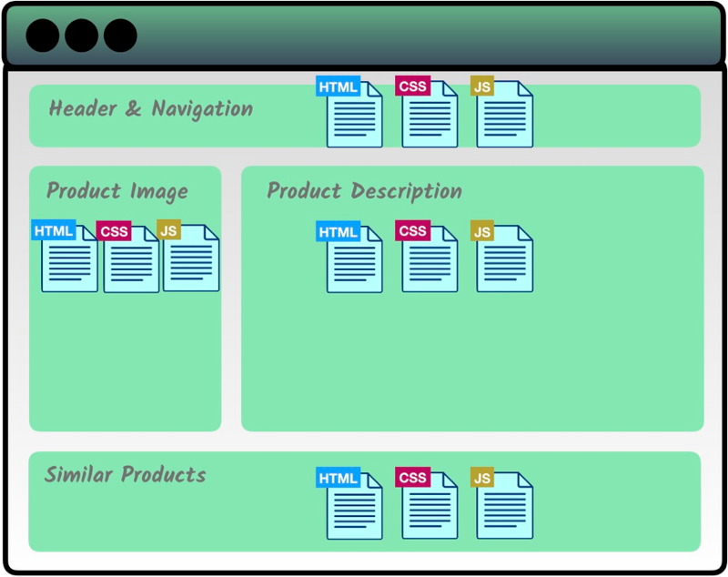

## Погружение в первый проект

В этой статье я хотел бы дать почувствовать, что значит - писать код на Vue.js (*если вы еще не видели примеров кода на Vue*) и показать некоторые примеры синтаксиса Vue.js. Я не буду заострять свое внимание на деталях, но покажу основные концепции данного фреймворка.

Как в большинстве JavaScript-приложений, перед нами стоит задача отобразить данные на HTML-странице.

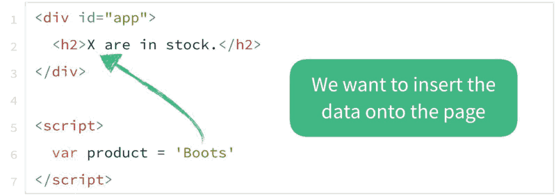

Процесс начала создания приложения на Vue.js весьма прост.

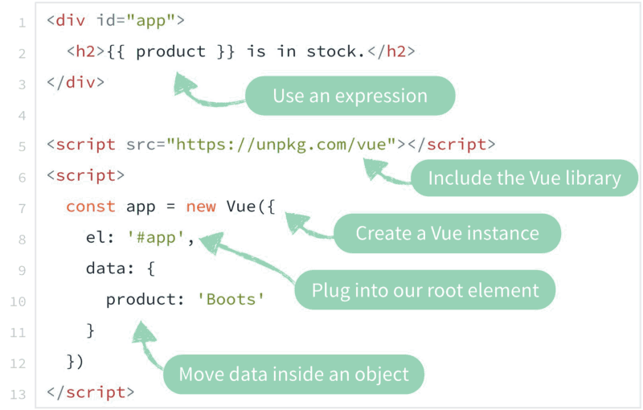

Как видно на изображении выше, к готовому проекту производится подключение библиотеки Vue.js. Затем в файле скрипта создается новый экземпляр объекта Vue, который подключается к корневому элементу на странице путем указания `id` этого элемента как значения поля `el`.

Затем внутрь созданного Vue-объекта помещаются данные как значение поля `data`. В HTML-коде меняем значение элемента `h2` с Х на двойные фигурные скобки, которые возвращают в виде строки значение переменной `product`.

Как видим, все отлично работает:

Вроде бы ничего особенного, но магия Vue.js начинается тогда, когда происходит изменение данных. Если открыть консоль браузера и в ней попробовать изменить значение переменной product, то на самой странице незамедлительно произойдет аналогичное изменение:

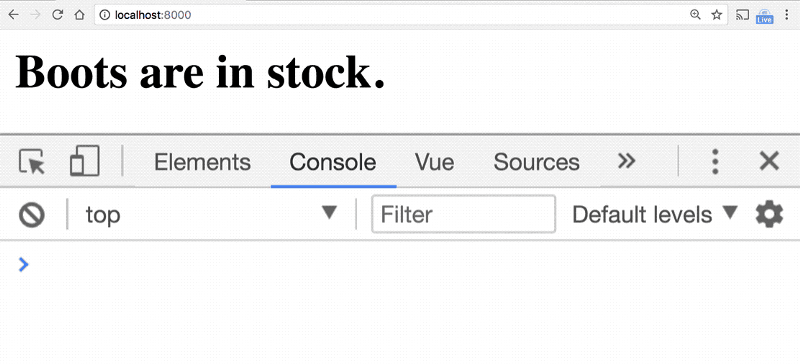

Это происходит потому, что фреймворк Vue.js является **реактивным**. Этот термин означает, что каждый раз, как происходит изменение данных, Vue.js берет на себя труд автоматически обновить эти данные там, где они отображаются на странице.

Такой подход работает со всеми типами данных - не только со строками. Поэтому вместо единичного значения переменной `product` мы будем использовать массив значений и изменим элемент `h2` на неупорядоченный список `ul`.

Для генерации новых элементов `li` в соответствии с каждым элементом массива я воспользуюсь специальным атрибутом (директивой) фреймворка Vue - `v-for`. Таким образом, каждому элементу массива будет соответствовать свой элемент `li`:

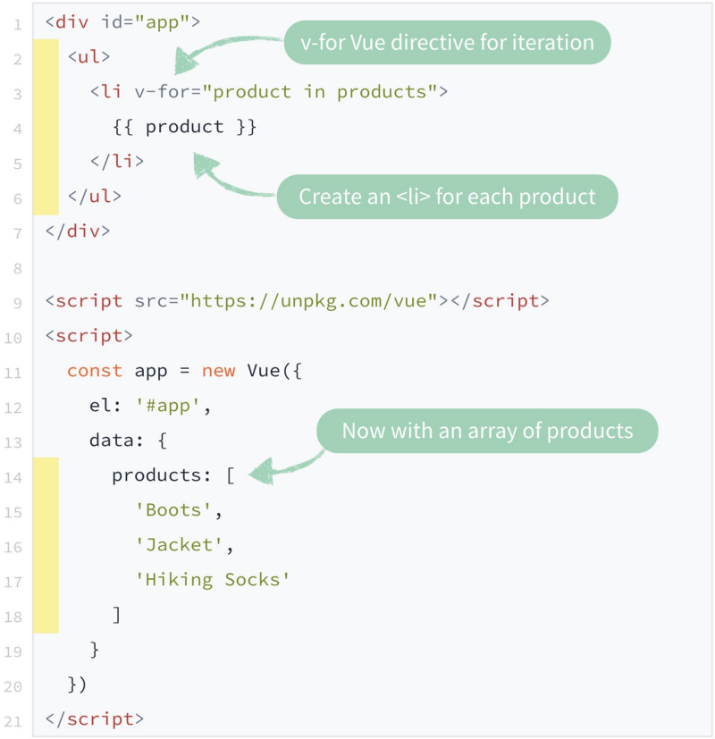

Если теперь снова перейти в окно браузера, то увидим такую картину:

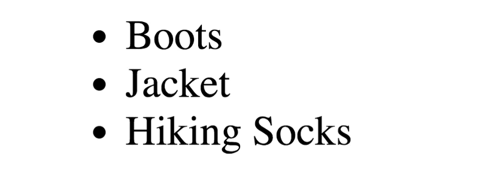

Используемые в нашем примере данные являются выдуманными, поэтому давайте исправим ситуацию и воспользуемся актуальным API, с помощью которого можно получить значения из любой базы данных:

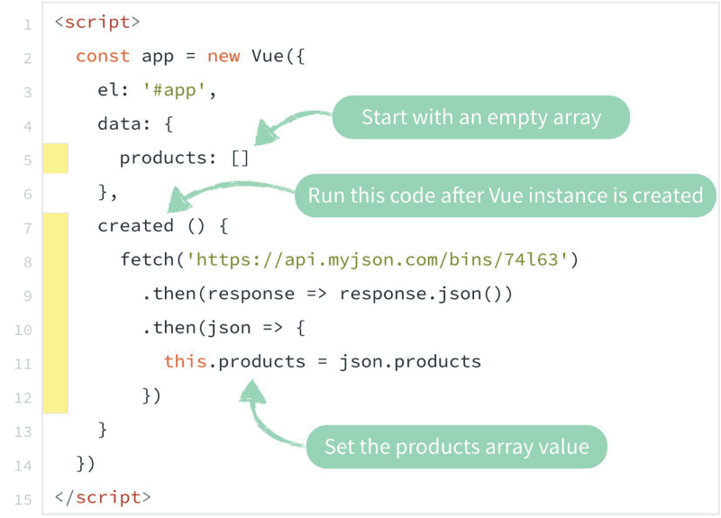

Если снова взглянуть на страницу, то мы увидим отображение полученных через API данных:

Как видим, теперь внутри каждого элемента `li` отображается объект, коллекцию которых мы получили. Для того, чтобы отобразить данные в читаемом виде, нужно слегка преобразовать код вывода на HTML-странице:

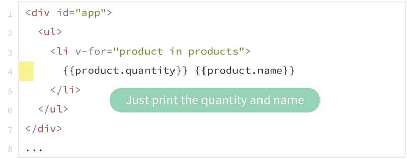

И тогда наш результат будет следующим:

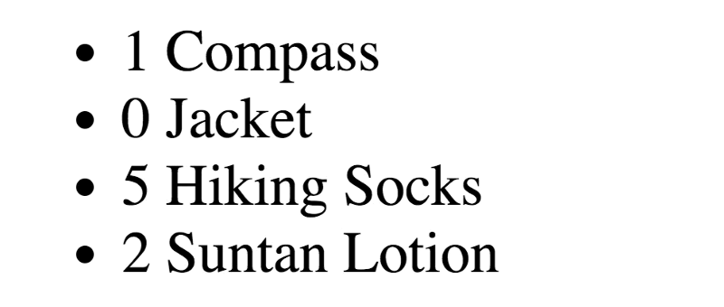

Стоит обратить внимание на записи в выводимом списке, у которых имеется значение 0. Преобразуем разметку путем добавления элемента `span` со значением "OUT OF STOCK" и воспользуемся директивой `v-if` для того, чтобы отображать данный span только тогда, когда значение переменной `quantity` равно нулю - `item.quantity === 0`:

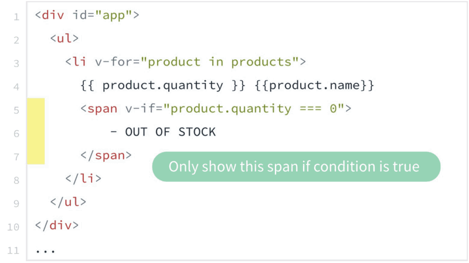

Убедимся в том, что теперь наши жакеты (Jacket) отсутствуют на складе:

Что, если мы теперь захотим вывести в конце списка общее количество продуктов? Для этой цели нужно создать вычисляемое свойстсво totalProducts, которое бы возвращало общее количество продуктов. Если вы недостаточно хорошо знакомы с методом reduce языка JavaScript, то ниже приведен пример его реализации для нашего случая:

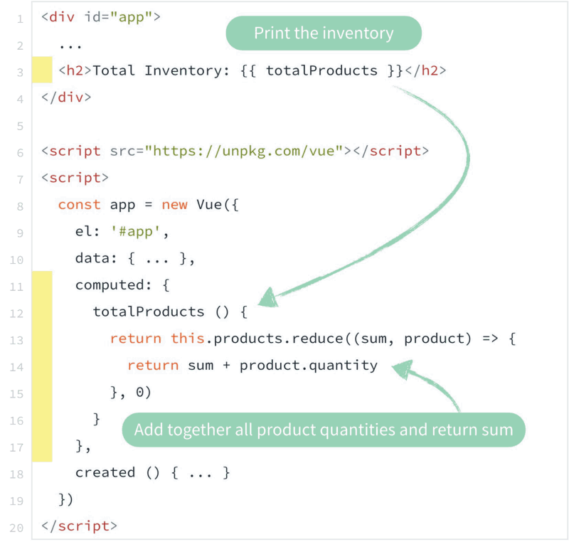

Теперь внизу нашего списка товаров есть строка с их общим количеством:

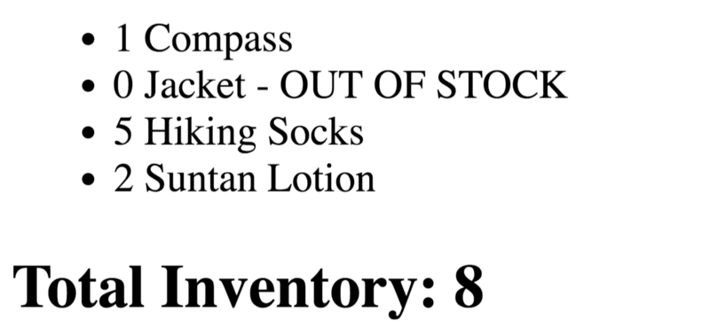

Возможно, настал удобный момент для того, чтобы рассказать о таком инструменте как [Vue.js devtools Chrome Extension](https://chrome.google.com/webstore/detail/vuejs-devtools/nhdogjmejiglipccpnnnanhbledajbpd?hl=en). Одной из замечательных особенностей этого расширения под браузер является возможность анализа загруженных данных:

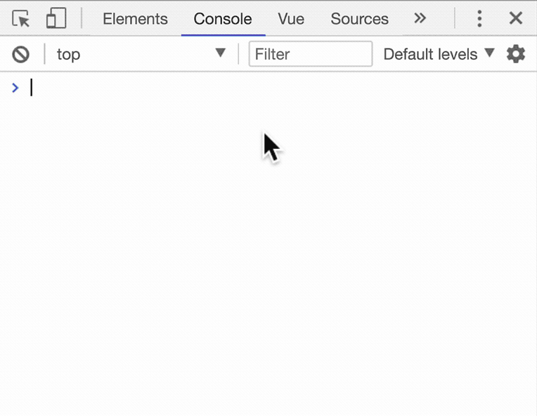

Для того, что еще раз продемонстрировать реактивность Vue.js, давайте удалим в консоли браузера пару элементов из массива продуктов и посмотрим, что произойдет при этом. Как видно на примере ниже, в результате обновится не только список товаров, но и общее их количество:

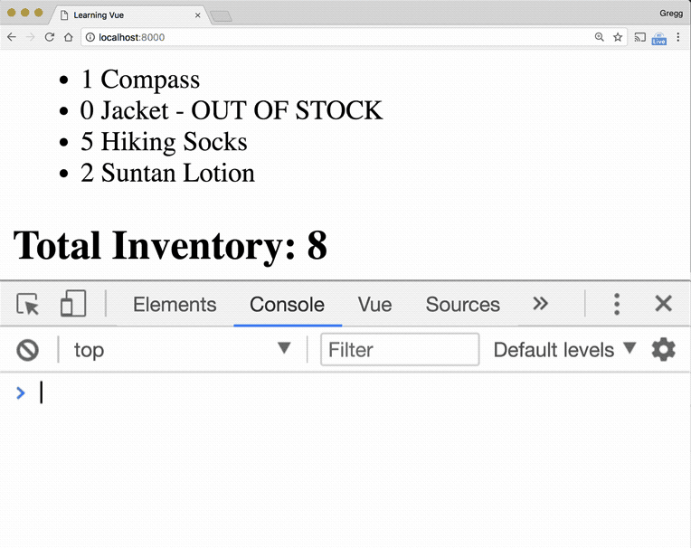

Теперь я хочу показать, как можно улучшить интерактивность страницы путем добавления на нее кнопок. Для каждого из продуктов списка давайте добавим кнопку `Add`. При клике на каждой из этих кнопок должно увеличиваться количество соответствующих этой кнопке продуктов на одну единицу:

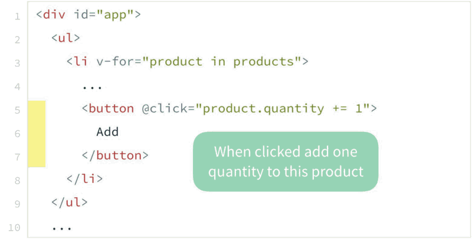

Обратите внимание, что при клике на кнопке не только увеличивается общее количество всех продуктов. Если увеличивать количество продукта Jacket, то также пропадает текст "OUT OF STOCK":

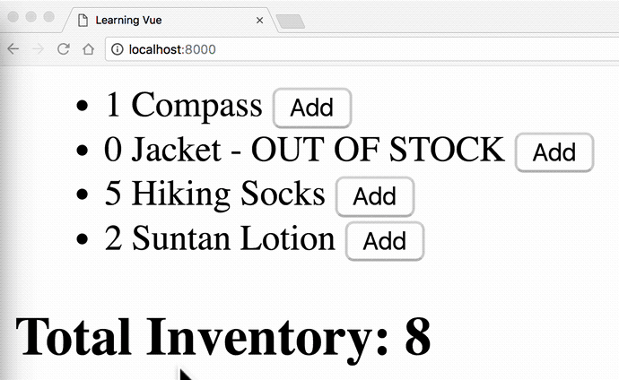

Но что, если необходимо прямо на странице задавать число продуктов, к примеру `jackets` или `hiking socks`? Для этого достаточно добавить в разметку новые элементы - поля для ввода данных и связать их со значением переменных при помощи директивы `v-model`. Для поля ввода не забудем указать, что оно должно принимать только целочисленные значения:

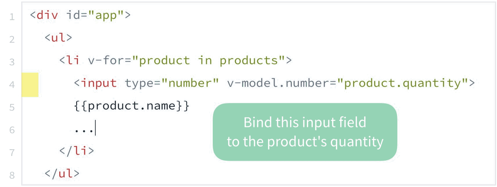

Теперь при вводе значений в каждом из полей автоматически меняется общая сумма всех продуктов. Я также могу установить значение поля в нуль и тогда появится надпись "OUT OF STOCK". Но кнопки добавления количества продуктов также продолжают работать:

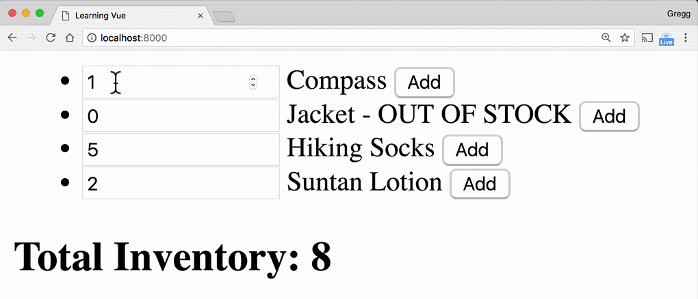

С исходным кодом полной версии этого проекта можно ознакомиться по [данной ссылке](https://jsfiddle.net/greggpollack/gr1cs2tv/).

## Еще несколько особенностей Vue.js

Если бы создавалось приложение похожего функционала, но большее по масштабу, у нас возникла бы необходимость разделить приложение на отдельные части и превратить их в самостоятельные компоненты. Такой подход помогает сохранять в порядке структуру приложения:

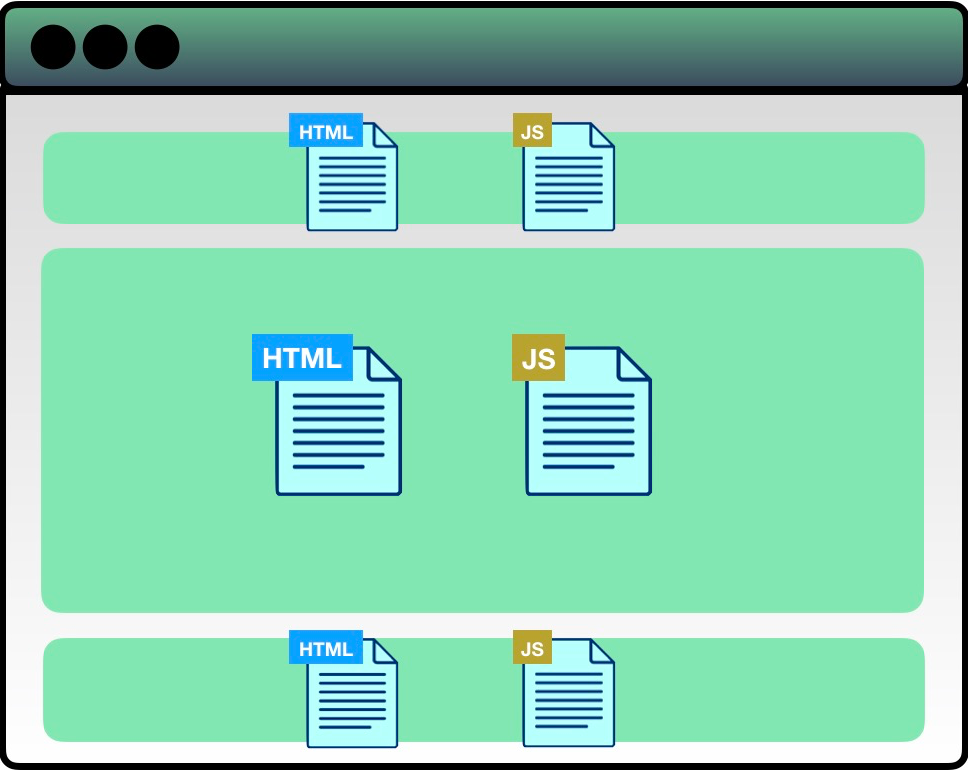

Фреймворк Vue.js также имеет утилиту командой строки `vue-cli`, при помощи которой можно быстро и легко создавать заготовку будущего проекта. На изображении ниже представлен один из вариантов запуска утилиты `vue-cli` и структуры созданного этой командой проекта:

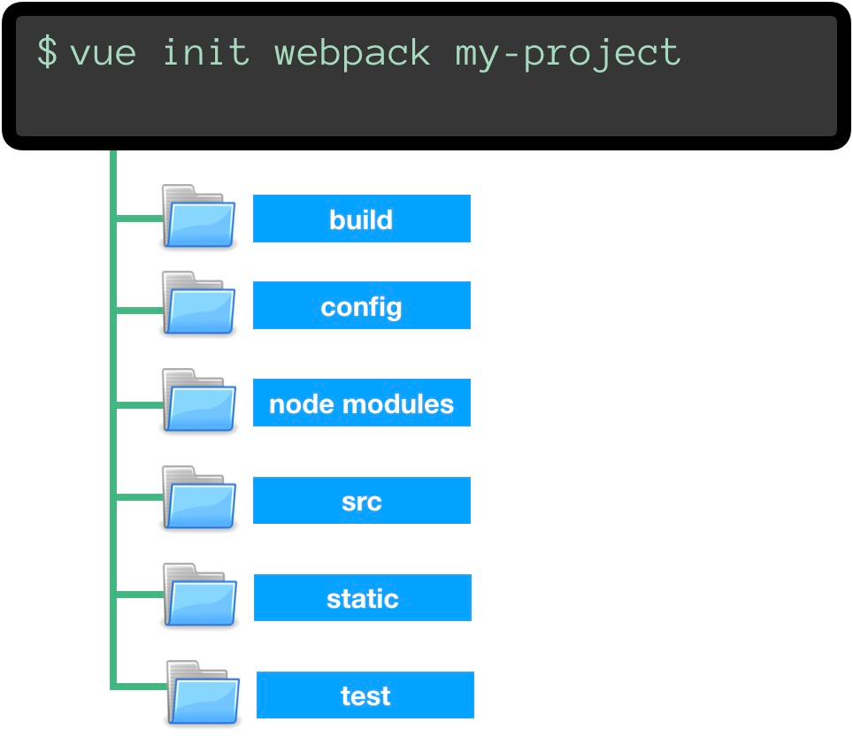

При разработке проекта на Vue.js можно также использовать однофайловые компоненты, которые содержат внутри себя код HTML, JavaScript, CSS и даже SCSS. Видимостью CSS-стилей такого компонента можно легко управлять при помощи атрибута scoped - в этом случае стили имеют локальную область видимости.

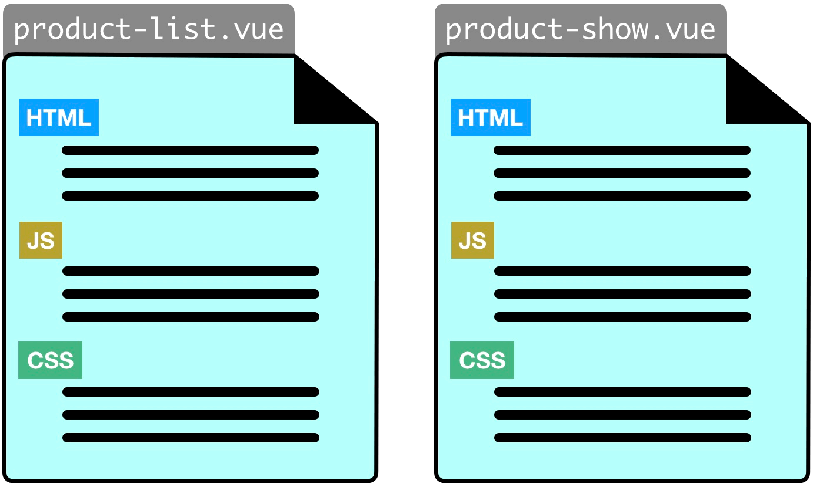

В заключение к данной статье можно сказать, что то, что в ней было описано - это лишь поверхностный обзор, на что способен Vue.js в действительности. У данного фреймворка гораздо больше возможностей по созданию, организации или масштабированию приложений. Для самостоятельного старта в написании приложений на Vue.js я порекомендовал бы два источника.

Первый источник - это бесплатный [Vue Resource Guide/Cheat Sheet](http://www.vuemastery.com/download-1), который был создан мною совместно с [VueMastery.com](http://www.vuemastery.com/). Затем можно переходить к [официальной документации Vue.js](https://vuejs.org/v2/guide/).

И в заключение я хотел бы поблагодарить Эвана Ю ([Evan You](https://twitter.com/youyuxi)), Криса Фрица ([Chris Fritz](https://twitter.com/chrisvfritz)), Сару Дрэснер ([Sarah Drasner](https://twitter.com/sarah_edo)) и Адама Яра ([Adam Jahr](https://twitter.com/AdamJahr)) за помощь в создании данного материала, а также видео.
