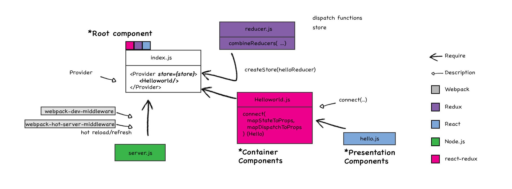
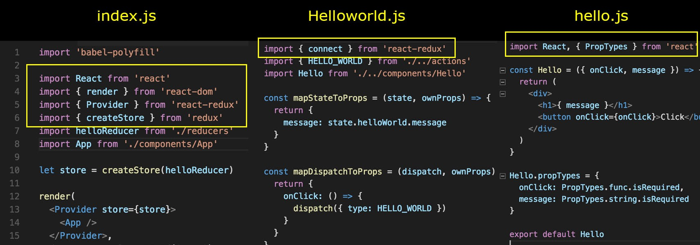

# Укрощаем изоморфный и универсальный шаблон: серверный рендеринг на React-Redux

*Перевод статьи [Peter Chang](https://hackernoon.com/isomorphic-universal-boilerplate-react-redux-server-rendering-tutorial-example-webpack-compenent-6e22106ae285)*


<p style="text-align: center;">Серверный рендеринг с помощью React Redux</p>

### *Ищите шаблон на React-Redux? Если да, то вряд ли у вас проблемы с поиском. Потому что вы нашли ТОННЫ шаблонов. ([Andrew Farmer](https://www.andrewhfarmer.com/starter-project/))*

**Вам также может понравиться:**
* [Isomorphic Application: Best Practice](https://hackernoon.com/react-redux-isomorphic-boilerplate-best-practice-example-tutorial-learning-rendering-reducer-action-8a448d0dbddb)
* [Isomorphic learn by doing: Adding new page](https://hackernoon.com/node-javascript-react-redux-isomorphic-boilerplate-tutorial-example-adding-new-page-component-router-match-f0347ad42c67)

С момента релиза React и Redux, я находился на седьмом небе от счастья потому что **1) Изоморфность React'a** дает преимущества к *скорости загрузки* и SEO при серверном рендеренге, и позволяет рендерить компоненты на клиенте уже после загрузки страницы и **2) Идеи [Flux-архитектуры](http://facebook.github.io/flux/)**, расширяющие компоненты React'а, с помощью использования однонаправленного потока данных.

Однако, после анализа тысячи шаблонов, мне пришлось выпить не одну чашку чая, чтобы успокоиться. Потому что ни один из шаблонов не оказался простым в освоении. Так что мне пришлось изучать разработку шаблонов с нуля. Эта статья представляет собой заметку, где я пояснил, как разбить шаблон на понятные части, шаг за шагом. В конце концов, я выделил 5 причин такого большого разнообразия изоморфных шаблонов:

1. **Dev-сервер и сборка проекта:**

   Настройка и создание среды разработки, для решения таких проблем, как *_хот-релоадинг(HMR)_*, *_слежение за изменением файлов_*, *_сборка бандлов_* итд. Популярные инструменты для этого: webpack, gulp, nodenpm, broserify, grunt.

2. **React-Redux-компоненты и поток данных**

3. **Роутинг**

   Чтобы решить какую иерархию роутинга использовать, нужно ответить на вопросы: это SPA? Должен ли сервер иметь CORS? Может быть стоит запускать приложение внутри express-сервера, а не на клиенте?

4. **Общие редюсеры/ экшен криэйторы**

   Зависит от роутинга

5. **Тесты**

Пока будем говорить о 2-м пункте, потому что он является неизменным от шаблона к шаблону. Остальные пункты меняются в зависимости от предпочтений разработчиков. **SSR**, **общие компоненты** и **Redux модули** — это ядро изоморфной flux-архитектуры, причина того почему в каждом шаблоне используются пакеты `react`, `redux` и `react-redux`.

Склонируйте из [репозитория](https://github.com/wahengchang/react-redux-boilerplate) `helloWorld-пример` на React-Redux, мы будем разбивать его на части, чтобы понять, как работает каждый файл:


<p style="text-align: center;">Серверный рендеринг с помощью React Redux</p>

Выше представлена структура работы приложения. Приложения используется Express, который работает только с одним роутом, с помощью функции _res.sendFile_ отображая index.html в браузере. Особое внимание следует уделить части, обведенной голубым контуром. Там показано взаимодействие React'а, Redux'а, корневого компонента, стора и редюсера.


<p style="text-align: center;">React-Redux-структура данных, стора, пропсов, стейта и компонентов</p>

Это пример, предоставленный [официальной документацией](http://redux.js.org/docs/basics/UsageWithReact.html), Facebook дает некоторые советы по организации иерархии компонентов: использование "умных" и "тупых" компонентов, использование **connect()** вместо **store.subscribe()** итд.

**index.js** — это вершина иерархии, корневой компонент, содержащий в себе все остальные компоненты в виде Virtual DOM, также это единственный компонент, использующий большое число зависимостей. Помимо этого, другие компоненты также включают в себя сторонние зависимости, обеспечивающие чистоту кода.

До сих пор я чувствую, как много Facebook сделал для нас, разработчиков.



*Ниже расположены функции, играющие ключевую роль в React-Redux-компонентах:*

**Provider**

Этот компонент [волшебным образом](https://reactjs.org/docs/context.html) делает **стор** доступным сразу во **всех умных компонентах**, не передавая его явно напрямую.

``` javascript
import { Provider } from 'react-redux'
let store = createStore(todoApp)
render(
  <Provider store={store}>
    <App />
  </Provider>,
  document.getElementById('root')
)
```

**connect(...)**

*Подключает React-компонент к Redux*, позволяя компоненту использовать стор верхнего уровня, при этом отпадает необходимость получать стор в виде пропсов от родителя. ([взято отсюда](https://medium.com/@firasd/quick-start-tutorial-using-redux-in-react-apps-89b142d6c5c1)).

Условно работу **connect(...)** можно разбить на следующие стадии:

1. **_Передача стора внутрь корневого компонента_**

   Чтобы начать подключать компоненты, нужно обернуть корневой компонент в *Provider* и передать в него переменную *store*:

```javascript
  import helloReducer from './reducers'
  import { Provider } from 'react-redux'
  import { createStore } from 'redux'
  let store = createStore(helloReducer)
  render(
   <Provider store={store}>
      <App />
   </Provider>,
   document.getElementById('root')
)
```
2. **_Подключение стора к умным компонентам_**

   Документация React-Redux описывает множество способов использования *connect*. Для моей цели понадобятся только **mapStateToProps** и **mapDispatchToProps**, чтобы покрыть всю функциональность.

— преобразование стейта в пропсы позволит компоненту *Hello* использовать **_this.props.message_** из **Redux стора**.

— преобразование диспатчинга экшенов для **_HELLO WORLD_** позволяет использовать **_this.props.onClick_**, как функцию внутри компонента **_Hello_**

```javascript
const mapStateToProps = (state, ownProps) => {
   return {
      message: state.helloWorld.message
   }
}
const mapDispatchToProps = (dispatch, ownProps) => {
   return {
      onClick: () => {
         dispatch({ type: HELLO_WORLD })
      }
   }
}
const HelloWorld = connect(
   mapStateToProps,
   mapDispatchToProps
)(Hello)
```

## NPM модули, которые вы должны знать

*Ниже представлены некоторые из npm модулей, о которых знают не все*

### react-redux

По умолчанию Redux не включен в React, поэтому пакет *_react-redux_* нужно устанавливать дополнительно.
Это предполагает, что вы должны использовать сборщики модулей типа **Webpack** или **Browserify**, которые работают с CommonJS.

### webpack-dev-middleware

Это простая миддлвара для **Webpack**. Служит для обработки файлов, загружающихся из npm пакетов. Используется **_только при разработке_** ([узнать больше](https://www.npmjs.com/package/webpack-dev-middleware)).

### webpack-hot-server-middleware

Миддлвара, работающая в паре с [webpack-dev-middleware](https://www.npmjs.com/package/webpack-dev-middleware), для **горячего обновления(HMR)** webpack-бандлов на серевере [узнать больше](https://www.npmjs.com/package/webpack-hot-server-middleware).

## Пояснения

*Ниже раскрыты некоторые термины и концепции*

### HMR
означает **Горячая Замена(Обновление) Модулей** или **хотрелоад**. Это фишка Webpack, позволяющая обновлять ваш Javascript-код без перезагрузки браузера. (узнать больше)(http://andrewhfarmer.com/webpack-hmr-tutorial/).


### combineReducers(...)

Создает объект, содержащий значение нескольких редюсеров, который затем можно передать в **_createStore_**.

### createStore (reducer, [preloadedState], [enhancer])

1. Создает Redux-стор, хранящий стейт-дерево вашего приложения.
2. Непосредственно создание функции _createStore(reducer, [initialState], [enhancer])_, которая затем передается в <Provider>:

```javascript
import { createStore, combineReducers } from 'redux'
function todos(state = [], action) {
   switch (action.type) {
      case 'ADD_TODO':
      return state.concat([ action.text ])
   default:
      return state
   }
}
function prefixTodos(state = [], action) {
   switch (action.type) {
      case 'PRE_ADD_TODO':
      return state.concat([ 'pre_'+action.text ])
   default:
      return state
   }
}
const mixReducers= combineReducers({todos, prefixTodos})
let store = createStore(mixReducers, [ 'Use Redux' ])
```

### subscribe( … ) VS connect(…)

По факту эти функции делают одно и то же в Redux, но официальная документация React'а **_НЕ_** советует использовать **_store.subscribe()_**, по той причине, что в `connect()` внесено множество оптимизаций, которые сложно сделать вручную, используя **_store.subscribe()_**.

С помощью **_connect()_** создается "умный" компонент, подключаемый к Redux-стору.

### "Умные" компоненты VS "Тупые" компоненты

Подробнее о разделении на "умные" и "тупые" [тут](https://medium.com/@dan_abramov/smart-and-dumb-components-7ca2f9a7c7d0)

* "Умные" компоненты предоставляют данные для "тупых" компонентов
* "Тупые" компоненты: 1) Не имеют зависимостей от остального приложения, 2) Определяют визуальную составляющую приложения.

## Ссылки:
* https://www.npmjs.com/package/redux
* http://redux.js.org/docs/introduction/Examples.html
* https://medium.com/@firasd/quick-start-tutorial-using-redux-in-react-apps-89b142d6c5c1
* http://andrewhfarmer.com/starter-project/
* https://www.codementor.io/reactjs/tutorial/redux-server-rendering-react-router-universal-web-app
* https://github.com/WilberTian/StepByStep-Redux/blob/master/06.react-redux.md

---

*Слушайте наш подкаст в [iTunes](https://itunes.apple.com/ru/podcast/девшахта/id1226773343) и [SoundCloud](https://soundcloud.com/devschacht), читайте нас на [Medium](https://medium.com/devschacht), контрибьютьте на [GitHub](https://github.com/devSchacht), общайтесь в [группе Telegram](https://t.me/devSchacht), следите в [Twitter](https://twitter.com/DevSchacht) и [канале Telegram](https://t.me/devSchachtChannel), рекомендуйте в [VK](https://vk.com/devschacht) и [Facebook](https://www.facebook.com/devSchacht).*
