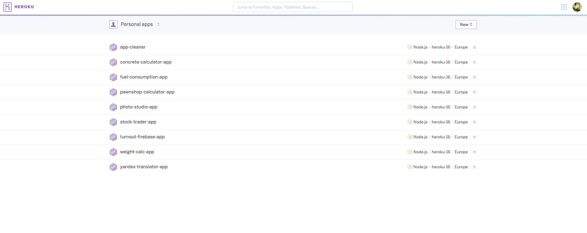
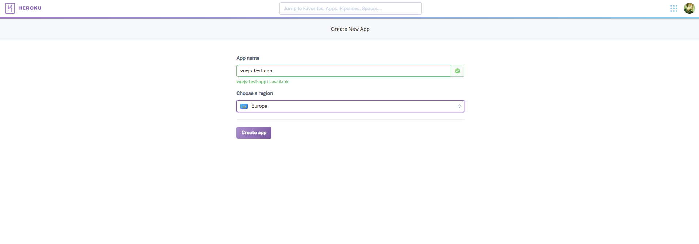

# Простой способ размещения Vue-приложения на Heroku

*Статья основана на оригинальной статье [Sagar Jauhari](https://twitter.com/sagarjauhari): [Quick-n-clean way to deploy Vue + Webpack apps on Heroku](https://medium.com/@sagarjauhari/quick-n-clean-way-to-deploy-vue-webpack-apps-on-heroku-b522d3904bc8).*


Если есть необходимость отделить процесс разработки приложения от процесса сборки и его размещения на удаленном сервере, то можно выбрать следующий вариант. Создать статические страницы на локальной машине, а затем отправить собранное приложение на Heroku.

В этом случае размер готового приложения будет минимальным, а процесс размещения на Heroku &mdash; простым и быстрым. Ниже описан пример такого способа.

## Введение

Процесс можно разбить на два этапа.

**Первый этап** &mdash; это работа с сервером Heroku. На этом этапе выполняется создание экземпляра приложения на сервере.

**Второй этап** &mdash; это работа на локальной машине. Это сборка приложения, создание дополнительных файлов, настройка локального репозитория, отправка приложения на сервер.

## Heroku

### Обзор Dashboard Heroku

Заходим на сервер [Heroku](https://www.heroku.com "Heroku"). Платформа поддерживает достаточно много языков программирования, но нам нужен JavaScript, так как мы будем создавать приложение на Vue.js. Heroku поддерживает Node.js &mdash; это то, что нам нужно.

После входа под своей учетной записью попадаем в Dashboard &mdash; здесь отображены все приложения (если они есть). Если ни одного приложения под Heroku еще не размещено, то будет "чистый лист".

Примерный вид Dashboard может быть таким:



### Создание нового приложения Heroku

Для создания нового приложения в Heroku наживаем сиротливую кнопку "New" в правом верхнем углу Dashboard и выбираем из краткого списка "Create new app". В новом окне всего два поля &mdash; имя нового приложения (App name) и сервер (Choose a region), на котором оно будет размещено (United States или Europe):



После нажатия на кнопку "Create app" сервер открывает страницу с готовым приложением и его настройками:


Больше ничего здесь трогать не будем. Перемещаемся на свою локальную машину.

## Локальное приложение

### Создание тестового приложения

Для создания тестового приложения на Vue.js я воспользуюсь консольной утилитой [vue-cli](https://github.com/vuejs/vue-cli "vue-cli") и фреймворком [Vuetify.js](https://vuetifyjs.com/vuetify/why-vuetify "Vuetify.js"). На [странице документации](https://vuetifyjs.com/vuetify/quick-start "Quick Start") представлены готовые консольные команды для быстрого развертывания Vue-приложения с поддержкой фреймворка Vuetify.js.

Выбираю конфигурацию Webpack Advanced, копирую команду и вставляю ее в терминал. Мое приложение будет называться `vuejs-test-app` и иметь поддержку webpack:

```bash
vue init vuetifyjs/webpack-advanced vuejs-test-app
```
После установки и запуска командой `npm run dev` приложения `vuejs-test-app` можно переходить к его сборке, так как писать в самом приложении я ничего не буду.

## Сборка тестового приложения

Сборка приложения выполняется очень просто. Для этого достаточно его остановить (Ctrl + C) и запустить консольную команду:

```bash
vuejs-test-app|master ⇒ npm run build

⠼ building for production...
Starting to optimize CSS...
Processing static/css/app.85650e97b093305219bcfefb06d394fb.css...
Processed static/css/app.85650e97b093305219bcfefb06d394fb.css, before: 246317, after: 234440, ratio: 95.18%
Hash: baebf154d09ccf68bf87
Version: webpack 2.7.0
Time: 37482ms
                                                  Asset       Size  Chunks                    Chunk Names
              static/js/app.8dae263c3aa28e3e0bf2.js.map    22.5 kB       1  [emitted]         app
               static/js/vendor.ebb37940e1c230f11cdc.js     270 kB       0  [emitted]  [big]  vendor
             static/js/manifest.7400c05b20625cb51a7a.js    1.51 kB       2  [emitted]         manifest
    static/css/app.85650e97b093305219bcfefb06d394fb.css     234 kB       1  [emitted]         app
           static/js/vendor.ebb37940e1c230f11cdc.js.map    1.88 MB       0  [emitted]         vendor
                  static/js/app.8dae263c3aa28e3e0bf2.js    3.15 kB       1  [emitted]         app
static/css/app.85650e97b093305219bcfefb06d394fb.css.map     381 kB       1  [emitted]         app
         static/js/manifest.7400c05b20625cb51a7a.js.map    14.6 kB       2  [emitted]         manifest
                                             index.html  636 bytes          [emitted]         
                               static/favicon-32x32.png    1.59 kB          [emitted]         
                                           static/v.png    5.67 kB          [emitted]         

  Build complete.
```

Если теперь посмотреть содержимое директории `dist`, то увидим там готовое приложение, с единственным файлом `index.html`, который необходим для правильной работы этого приложения на web-сервере:

```bash
vuejs-test-app|master ⇒ ll dist
total 8
-rw-r--r--  1 aarongreenberg  staff   636B Sep  5 20:54 index.html
drwxr-xr-x  6 aarongreenberg  staff   204B Sep  5 20:54 static
```

## Дополнительные файлы

Процесс подготовки приложения на этом не заканчивается. Для следующего шага нужно перейти в директорию `dist` и создать в ней *два файла*: `package.json` и `server.js`:

```bash
vuejs-test-app|master ⇒ cd dist
dist|master ⇒ touch {package.json,server.js}
dist|master ⇒ ll
total 8
-rw-r--r--  1 aarongreenberg  staff   636B Sep  5 20:54 index.html
-rw-r--r--  1 aarongreenberg  staff     0B Sep  5 20:58 package.json
-rw-r--r--  1 aarongreenberg  staff     0B Sep  5 20:58 server.js
drwxr-xr-x  6 aarongreenberg  staff   204B Sep  5 20:54 static
```

Оба эти файла необходимы Heroku для того, чтобы знать, что следует делать с теми статическими наборами данных, которые являются готовым приложением и которые будут отправляться на удаленный репозиторий Heroku.

Содержимое файла `package.json` будет следующим:

```js
{
  "name": "test-vuejs-app",
  "version": "1.0.0",
  "description": "Heroku App",
  "author": "gearmobile",
  "private": true,
  "scripts": {
    "postinstall": "npm install express"
  }
 }
```

Основная цель создания файла `package.json` &mdash; дать команду Heroku на установку express-сервера, который будет использоваться для размещаемого на Heroku приложения:

```js
npm install express
```

Никаких дополнительных пакетов нет необходимости указывать в этом файле, так как в оригинальном файле `package.json`, расположенном в корне приложения, уже указаны все зависимости, необходимые для сборки приложения.

Содержимое файла `server.js` следующее:

```js
var express = require('express')
var path = require('path')
var serveStatic = require('serve-static')
app = express()
app.use(serveStatic(__dirname))
var port = process.env.PORT || 5000
app.listen(port)
console.log('server started ' + port)
```

Так же как и в предыдущем случае, данный файл "подсказывает" Heroku, что следует делать с размещенным приложением. При помощи файла `server.js` Heroku выполняет запуск команды `npm start`, что в свою очередь осуществляет запуск размещенного на Heroku приложения.

Можно (*и нужно*) протестировать готовую сборку приложения на локальной машине перед его размещением на удаленном сервере. Для этого необходимо перейти в директорию `dist` проекта (если вы еще не перешли туда):

```bash
cd dist
```

... и выполнить внутри этой директории следующую команду:

```bash
dist|master ⇒ npm start

> test-vuejs-app@1.0.0 start /Users/aarongreenberg/Projects/experiments/vuejs-test-app/dist
> node server.js

server started 5000
```

Строка `server started 5000` говорит об успешном запуске приложения на локальнй машине. Теперь можно смело размещать его на Heroku. Останавливаем запущенный сервер сочетанием клавиш `Ctrl + C`.

## Настройка локального репозитория

Предположим, что готовый проект на локальной машине располагается в директории `vuejs-test-app` (как в моем случае). Подготовленное приложение на удаленном сервере Heroku я назвал аналогично &mdash; `vuejs-test-app`.

Поэтому необходимо подключить удаленный репозиторий приложения `vuejs-test-app` на сервере к приложению `vuejs-test-app` на локальной машине. Это позволит разместить наше локальное приложение в удаленном репозитории.

Для этого выхожу из директории `dist` (*если мы еще находимся там*) так, чтобы оказаться в **корне приложения** `vuejs-test-app`. Затем выполняю подключение удаленного репозитория:

```bash
dist|master ⇒ cd ..
vuejs-test-app|master ⇒ heroku git:remote -a vuejs-test-app
 ▸    heroku-cli: update available from 6.12.5-17216bc to 6.14.16-9ae58fc
set git remote heroku to https://git.heroku.com/vuejs-test-app.git
```

Директория `dist` на данный момент **не находится** под версионным контролем Git, однако необходимо сделать так, чтобы она попала под него. Для этого я нахожу в корне директории `vuejs-test-app` файл `.gitignore`:

```bash
vuejs-test-app|master ⇒ nano .gitignore
```

... и удаляю в нем строку `dist/`, тем самым разрешив Git осуществлять контроль над этой папкой:

```bash
.DS_Store
node_modules/
// здесь была строка dist/
npm-debug.log*
yarn-debug.log*
yarn-error.log*

# Editor directories and files
.idea
*.suo
*.ntvs*
*.njsproj
*.sln
*.swp
```

Теперь осталось зафиксировать это изменение &mdash; выполнить commit. Закрываю редактор `nano` (`Ctrl + O`, `Ctrl + X`) и выполняю команды (здесь используются aliases, предоставляемые командной оболочкой [zsh](http://zsh.sourceforge.net/Intro/intro_1.html "ZSH") и оберткой [Oh-My-Zsh](http://ohmyz.sh "Oh-My-Zsh")):

```bash
vuejs-test-app|master ⇒ gaa
vuejs-test-app|master ⇒ gcmsg "Adding dist folder"
```

Отлично &mdash; мы выполнили почти все шаги для размещения приложения на Heroku!

### Размещаем директорию dist на Heroku

Размещаю приложение на Heroku двумя командами:

```bash
vuejs-test-app|master ⇒ heroku buildpacks:set heroku/nodejs
Buildpack set. Next release on vuejs-test-app will use heroku/nodejs.
Run git push heroku master to create a new release using this buildpack.
```

```bash
vuejs-test-app|master ⇒ cd ..
experiments|master ⇒ git subtree push --prefix vuejs-test-app/dist heroku master
```
Все &mdash; приложение `vuejs-test-app` размещено на Heroku. Чтобы открыть его и посмотреть, нужно нажать кнопку Open app. В новой вкладке браузера откроется запущенное приложение:


В адресной строке браузера хорошо виден url запущенного приложения. Ну и сам стандартный вид приложения на Vuetify.js

***
