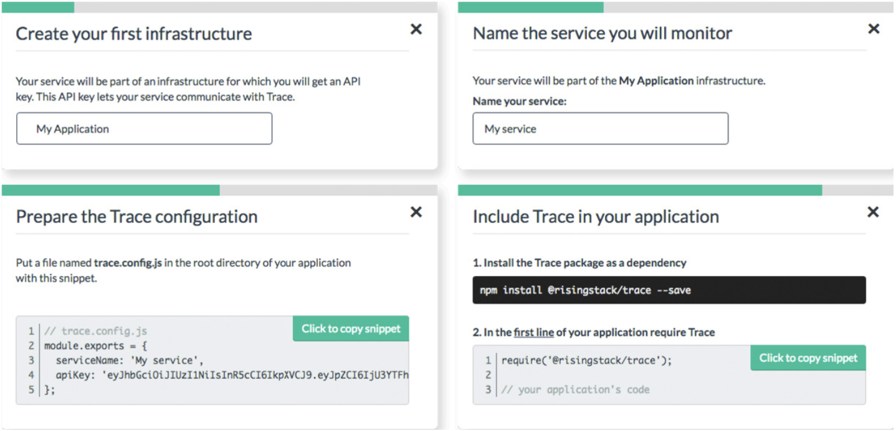
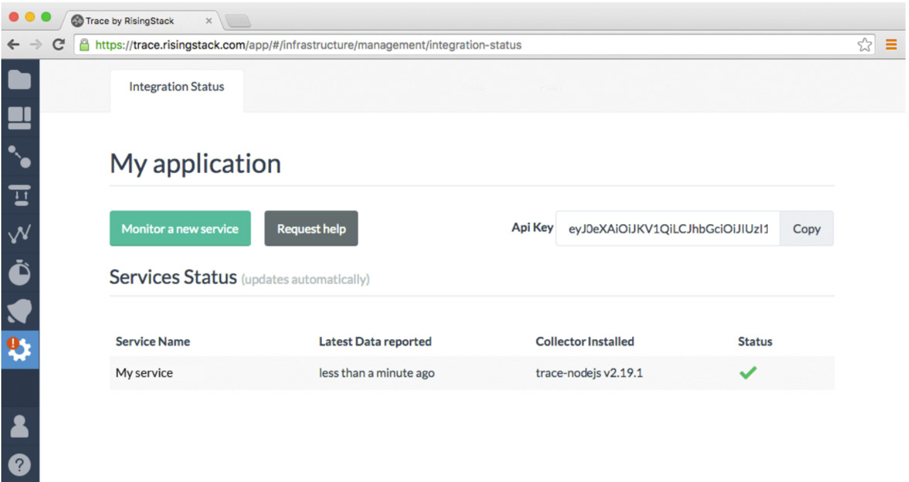
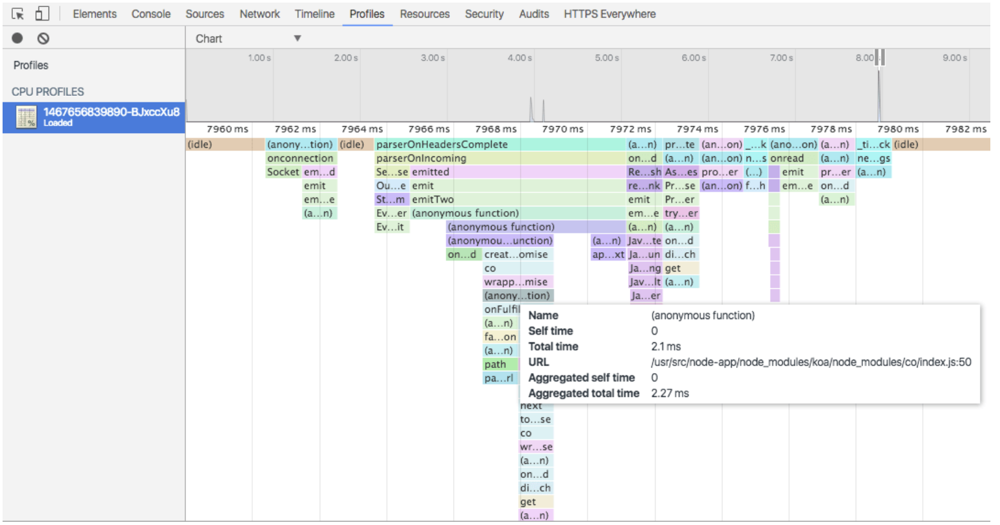

# Мониторинг Node.js-приложений

В последней главе этого учебника я расскажу вам, как настроить мониторинг Node.js и как найти важнейшие проблемы в продакшен-среде.

## Важность мониторинга Node.js

Получение информации о работе системы в продакшене имеет решающее значение при создании Node.js-приложений! У вас есть обязательство постоянно обнаруживать узкие места и выяснить, что замедляет работу вашего продукта.

Ещё большая задача заключается в том, чтобы обрабатывать и пресекать простои. Вы должны быть уведомлены, как только это произойдёт, желательно, прежде чем ваши клиенты начнут жаловаться. Исходя из этих потребностей, надлежащий мониторинг должен дать вам, по крайней мере, следующие возможности и понимание поведения вашего приложения:

* **Профилирование на уровне кода:** Вы должны понимать, сколько времени требуется для запуска каждой функции в продакшен-среде, а не только локально.
* **Мониторинг сетевых подключений:** Если вы строите микросервисную архитектуру, вы должны контролировать сетевые подключения и снизить задержки в обмене данными между вашими службами.
* **Дашборд отслеживания производительности:** Знание и постоянное наблюдение за важнейшими метриками производительности вашего приложения необходимы для быстрой и стабильной продакшен-системы.
* **Предупреждения в режиме реального времени:** По понятным причинам, если что-то ломается, вам необходимо немедленно получить уведомление. Это означает, что вам нужны инструменты, которые могут интегрироваться с Pagerduty или Opsgenie, поэтому ваша DevOps-команда не пропустит ничего важного.

> «Получение информации о работе системы в продакшене имеет решающее значение при создании nodejs-приложений»

## Мониторинг сервера простив мониторинга приложения

Разработчики придерживающиеся первой концепции склонны смешивать мониторинг серверов и мониторинг самих приложений. Поскольку мы склонны делать много виртуализаций, эти концепции следует рассматривать отдельно, так как один сервер может поддерживать десятки приложений.

Рассмотрим основные различия!

## Мониторинг сервера

Мониторинг сервера отвечает за хост-машину. Он должен помочь вам ответить на следующие вопросы:

* У моего сервера достаточно места на диске?
* У него достаточно ресурсов процессора?
* У моего сервера достаточно памяти?
* Доступен ли он по сети?

Для мониторинга сервера вы можете использовать такие инструменты, как [zabbix](http://www.zabbix.com/).

## Мониторинг приложения

Мониторинг приложения, с другой стороны, отвечает за здоровье конкретного экземпляра приложения. Он должен дать вам ответы на следующие вопросы:

* Может ли экземпляр приложения попасть в базу данных?
* Как много запросов обрабатывается?
* Каково время ответа для отдельных случаев?
* Может ли моё приложение обрабатывать запросы? Оно запущено?

Для мониторинга приложения я рекомендую использовать наш инструмент под названием [Trace](https://trace.risingstack.com/). Что же ещё? :)

Мы разработали его как простой в использовании и эффективный инструмент, который можно использовать для мониторинга и отладки приложений с момента их создания, вплоть до того, что у вас есть огромное приложение в продакшене с сотнями сервисов.

## Как использовать Trace для мониторинга Node.js

Чтобы начать работу с Trace, перейдите на [https://trace.risingstack.com](https://trace.risingstack.com) и создайте свою бесплатную учётную запись! 

После регистрации выполните следующие действия, чтобы добавить Trace в ваше Node.js-приложение. Это займёт всего минуту — и это шаги, которые вы должны выполнить:

Легко, правда? Если все пойдёт хорошо, вы увидите, что подключенный сервис только что начал отправлять данные в Trace:

## #1: Измерьте свою производительность

В качестве первого шага мониторинга вашего приложения Node.js я рекомендую перейти на страницу метрик и проверить производительность ваших сервисов.

* Вы можете использовать панель времени ответа для проверки медианы и 95-го перцентиля. Это помогает вам понять, когда и почему ваше приложение замедляется и как оно влияет на ваших пользователей.
* График пропускной способности показывает количество запросов в минуту (rpm) для категорий кодов состояния (200-299 // 300-399 // 400-499 //> 500). Таким образом, вы можете легко отделить здоровые и проблемные HTTP-запросы в своём приложении.
* График использования памяти показывает, сколько памяти использует ваш процесс. Это очень полезно для распознавания утечек памяти и предотвращения сбоев.

Если вы хотите увидеть специальные метрики Node.js, проверьте графики сбора мусора и графики циклов событий. Они могут помочь вам отследить утечки памяти. Прочтите нашу [документацию по метрикам](http://trace-docs.risingstack.com/docs/service-metrics).

## #2: Настройте уведомления

Как я упоминал ранее, для вашего приложения в продакшене вам нужна надлежащая система оповещения.

Перейдите на страницу оповещения Trace и нажмите **Create a new alert**.

* Самое важное, что нужно сделать, это настроить оповещения о простоях и проблемах с памятью. Trace уведомит вас по электронной почте / Slack / Pagerduty / Opsgenie, и вы также можете использовать Webhooks.
* Я рекомендую настроить оповещение, которое мы называем «Ошибка по коду состояния», чтобы узнать о HTTP-запросах с кодами состояния 4XX или 5XX. Это ошибки, о которых вам следует позаботиться.
* Также может быть полезно создать оповещение о времени отклика — и получить уведомление, когда ваше приложение начнёт работать медленней.

## #3: Исследуйте дампы памяти

Перейдите на страницу *Profiler* и запросите новый дамп памяти, подождите 5 минут и запросите другой. Загрузите их и откройте на странице *Profiles* Chrome DevTool. Выберите вторую (самую последнюю) и нажмите *Comparison*.

Этим способом вы можете легко найти утечки памяти в вашем приложении. Мы подробно описали этот процесс, вы можете прочитать его здесь: [Охота на привидение — Поиск утечки памяти в Node.js](https://blog.risingstack.com/finding-a-memory-leak-in-node-js/)

## #4:Профайлинг CPU

Профилирование на уровне кода важно для понимания того, сколько времени занимает ваша функция для работы в реальной продакшен-среде. К счастью, Trace также покрывает эту область.

Все, что вам нужно сделать, - перейти на вкладку **CPU Profiles** на странице * Profiler*. Здесь вы можете запросить и скачать профиль, который вы можете загрузить в Chrome DevTool. После того, как вы его загрузили, вы сможете увидеть 10-секундный фрейм своего приложения и просмотреть все свои функции с таймингами и URL-адресами.

С помощью этих данных вы сможете выяснить, что замедляет ваше приложение и справится с этим!

---

## Конец

Вот и всё.

За время чтения 13 глав Node Hero вы изучили основы построения отличных приложений с помощью Node.js.

**Надеюсь, вам понравилось и вы стали лучше разбираться в Node.js**! Пожалуйста, поделитесь этим учебником с друзьями, если вы считаете, что им это тоже нужно — и покажите им Trace. Это отличный инструмент для разработки на Node.js!

Если вы хотите продолжить совершенствование своих навыков Node.js-разработчика, рекомендуем наш новый учебник [Node.js at Scale](https://blog.risingstack.com/nodejs-at-scale-npm-best-practices/)!

---

*Слушайте наш подкаст в [iTunes](https://itunes.apple.com/ru/podcast/девшахта/id1226773343) и [SoundCloud](https://soundcloud.com/devschacht), читайте нас на [Medium](https://medium.com/devschacht), контрибьютьте на [GitHub](https://github.com/devSchacht), общайтесь в [группе Telegram](https://t.me/devSchacht), следите в [Twitter](https://twitter.com/DevSchacht) и [канале Telegram](https://t.me/devSchachtChannel), рекомендуйте в [VK](https://vk.com/devschacht) и [Facebook](https://www.facebook.com/devSchacht).*

[Глава на Medium]()
